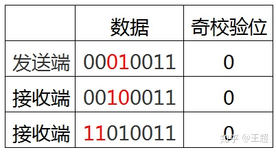
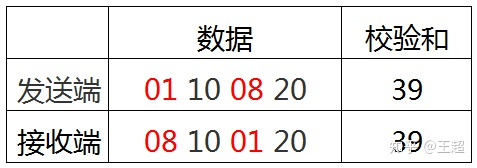
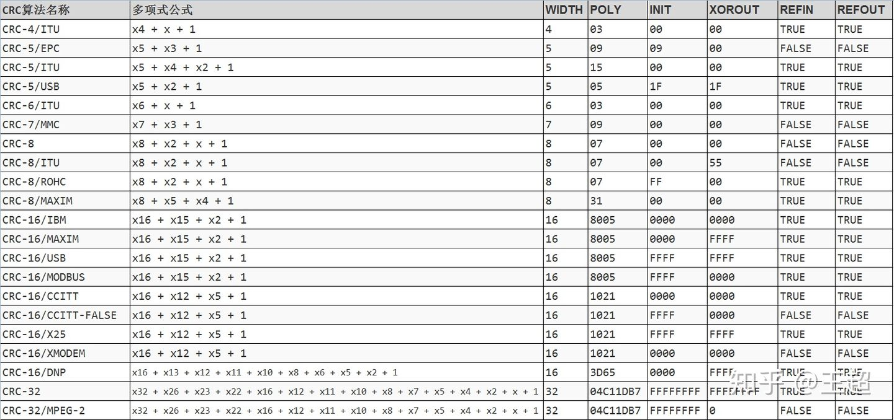
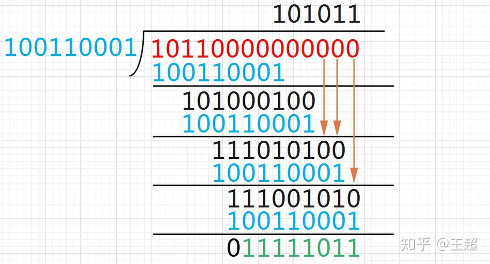
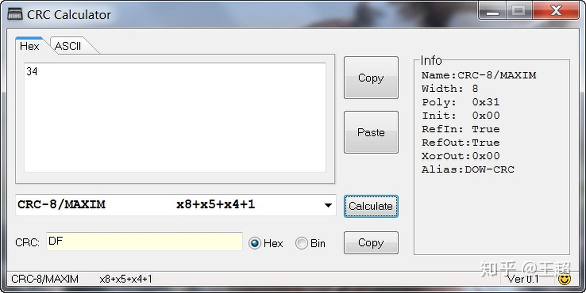
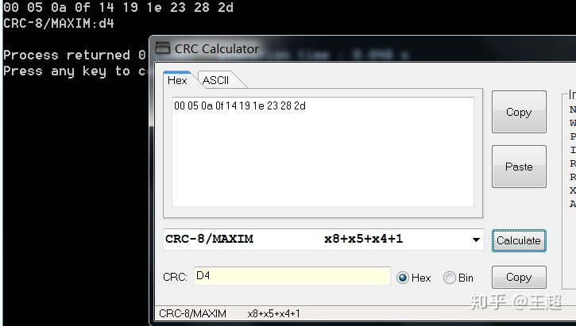
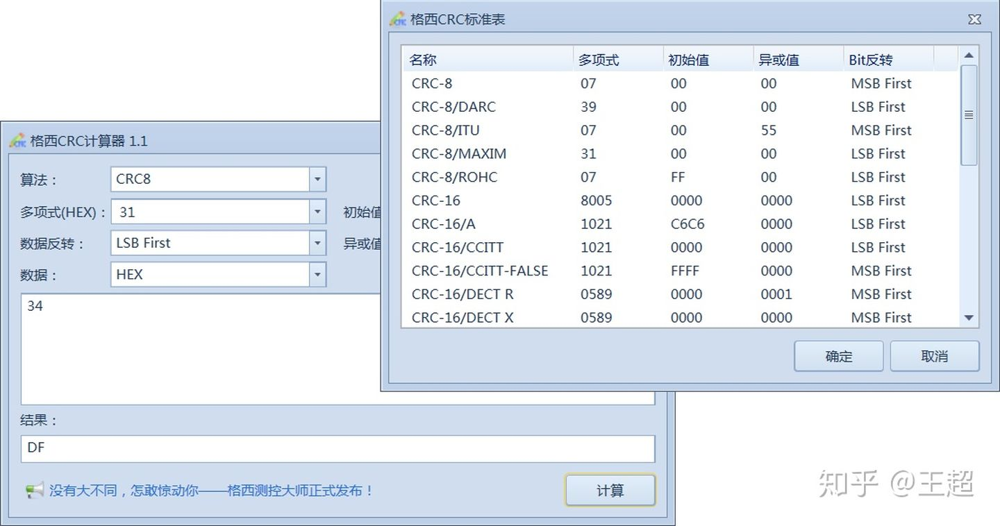

> 那简而言之就是 取首位 异或(首位为0 除数为0) 左移 上述三个步骤循环呗 当左移后余数长度小于被除数时则取余 也可以这么理解吧 当余数开头出现n个0的时候就可以全部消掉直到首位是1 商补上n-1个0和一个1就可以了 继续异或运算嘛 我是看到有好几题余数开头俩0的 分析看看

# 模2除法(CRC校验码计算)

鉴于网上的讲解自己好不容易才看懂…所以整理了一下, 也方便大家能够理解

## 模2加减法

模2除法需要用到`模2加减法`,关于`模2加减法`,其实就是`异或操作`,规则如下:

```c
//不需要考虑进位和借位
0 ± 0 = 0
1 ± 1 = 0
0 ± 1 = 1
1 ± 0 = 1
例: 1101 ± 1001 = 0100
计算如下:
		  1 1 0 1 
		± 1 0 0 1 
		-----------
		  0 1 0 0
1234
```

**简记:同为0,异为1**

------

## 模2除法:

规则:假设被除数X,和除数P,余数R

1. X除以P(对X和P做模2加减法),当前**X**首位为1时,商1,为0时商0

2. 所得余数R**去除首位**(即左移一位):

   > 若R第一位为0,将其作为新的被除数,除以0,此时其首位为0,商即为0
   > 若R第一位为1,将其作为新的被除数,除以P,此时其首位为1,商即为1

3. 重复第2步直到R位数少于P位数

------

## 例:`1111000`对除数`1101`做模2除法:

#### 先说结果: 商`1011`余`111`

#### 整体运算

```c
      1 0 1 1     //商
---------------
1 1 1 1 0 0 0     //被除数,注意首位为1
1 1 0 1	          //被除数首位为1,除以除数
---------------
  0 1 0 0 0 0     //余数去除首位,作为新的被除数
  0 0 0 0         //被除数首位为0,除以0
---------------
    1 0 0 0 0     //余数去除首位,作为新的被除数
    1 1 0 1       //被除数首位为1,除以除数  
---------------
      1 0 1 0     //余数去除首位,作为新的被除数
      1 1 0 1     //被除数首位为1,除以除数
---------------
        1 1 1     //余数,此时余数位数少于除数,不能继续除了
123456789101112131415
```

#### 分步分析

##### 第一步(每一步其实都是模2加减法运算):

```c
      1         //商
-------------
1 1 1 1 0 0 0   //被除数,注意首位为1
1 1 0 1	        //除数
-------------
0 0 1 0 0 0 0   //余数,模2运算后结果
123456
```

> 商的第一位:被除数首位为1,商为1(只要被除数首位非0,商就是1)

##### 第二步:余数去除首位(左移一位),当第一位为0时,除以0;为1时,除以除数。

```c
      1 0        //商
---------------
  0 1 0 0 0 0    //余数去除首位,作为新的被除数
  0 0 0 0        //被除数首位为0,除以0
---------------
  0 1 0 0 0 0    //余数,模2运算后结果
123456
```

> 商的第二位:被除数首位为0,商为0(只要被除数首位是0商就是0)

##### 第三步

```c
      1 0 1      //商
----------------
    1 0 0 0 0    //余数去除首位,作为新的被除数
    1 1 0 1      //被除数首位为1,除以除数
----------------
    0 1 0 1 0    //余数,模2运算后结果
123456
```

> 商的第三位:被除数首位为1,商为1

##### 第四步

```c
      1 0 1 1     //商
----------------
      1 0 1 0     //余数去除首位,作为新的被除数
      1 1 0 1     //被除数首位为1,除以除数
----------------
      0 1 1 1     //余数,此时余数位数(这里的0要忽略掉,不参与下一轮,因为最上面的被除数后面
      			  //没有数可以给这里往后补一位了)少于除数位数,不能继续除了
1234567
```

> 商的第四位:被除数首位为1,商为1
> 此时不能继续做除法,计算结束

##### 得到最终结果: 商`1011`余`111`


- 前言
- CRC算法简介
- CRC计算
- CRC校验
- CRC计算的C语言实现
- CRC计算工具
- 总结

### 前言

最近的工作中，要实现对通信数据的CRC计算，所以花了两天的时间好好研究了一下，周末有时间整理了一下笔记。

一个完整的数据帧通常由以下部分构成：


校验位是为了保证数据在传输过程中的完整性，采用一种指定的算法对原始数据进行计算，得出的一个校验值。接收方接收到数据时，采用同样的校验算法对原始数据进行计算，如果计算结果和接收到的**校验值一致**，说明数据校验正确，这一帧数据可以使用，如果不一致，说明传输过程中出现了差错，这一帧数据丢弃，请求重发。

常用的校验算法有奇偶校验、校验和、CRC，还有LRC、BCC等不常用的校验算法。

以串口通讯中的奇校验为例，如果数据中1的个数为奇数，则奇校验位0，否则为1。

例如原始数据为：0001 0011，数据中1的个数（或各位相加）为3，所以奇校验位为0。这种校验方法很简单，但这种校验方法有很大的误码率。假设由于传输过程中的干扰，接收端接收到的数据是0010 0011，通过奇校验运算，得到奇校验位的值为0，虽然校验通过，但是数据已经发生了错误。





校验和同理也会有类似的错误：





一个好的校验校验方法，配合数字信号编码方式，如(差分)曼彻斯特编码，(不)归零码等对数据进行编码，可大大提高通信的健壮性和稳定性。例如以太网中使用的是CRC-32校验，曼彻斯特编码方式。本篇文章介绍CRC校验的原理和实现方法。

### CRC算法简介

> 循环冗余校验（Cyclic Redundancy Check， CRC）是一种根据网络数据包或计算机文件等数据产生简短固定位数校验码的一种信道编码技术，主要用来检测或校验数据传输或者保存后可能出现的错误。它是利用除法及余数的原理来作错误侦测的。

CRC校验计算速度快，检错能力强，易于用编码器等硬件电路实现。从检错的正确率与速度、成本等方面，都比奇偶校验等校验方式具有优势。因而，CRC 成为计算机信息通信领域最为普遍的校验方式。常见应用有以太网/USB通信，压缩解压，视频编码，图像存储，磁盘读写等。

### CRC参数模型

不知道你是否遇到过这种情况，同样的CRC多项式，调用不同的CRC计算函数，得到的结果却不一样，而且和手算的结果也不一样，这就涉及到CRC的参数模型了。计算一个正确的CRC值，需要知道CRC的参数模型。

一个完整的CRC参数模型应该包含以下信息：WIDTH，POLY，INIT，REFIN，REFOUT，XOROUT。

- NAME：参数模型名称。
- WIDTH：宽度，即生成的CRC数据位宽，如CRC-8，生成的CRC为8位
- POLY：十六进制多项式，省略最高位1，如 x8 + x2 + x + 1，二进制为1 0000 0111，省略最高位1，转换为十六进制为0x07。
- INIT：CRC初始值，和WIDTH位宽一致。
- REFIN：true或false，在进行计算之前，原始数据是否翻转，如原始数据：0x34 = 0011 0100，如果REFIN为true，进行翻转之后为0010 1100 = 0x2c
- REFOUT：true或false，运算完成之后，得到的CRC值是否进行翻转，如计算得到的CRC值：0x97 = 1001 0111，如果REFOUT为true，进行翻转之后为11101001 = 0xE9。
- XOROUT：计算结果与此参数进行异或运算后得到最终的CRC值，和WIDTH位宽一致。

通常如果只给了一个多项式，其他的没有说明则：INIT=0x00，REFIN=false，REFOUT=false，XOROUT=0x00。

常用的21个标准CRC参数模型：





CRC校验在电子通信领域非常常用，可以说有通信存在的地方，就有CRC校验：

- 美信(MAXIM)的芯片DS2401/DS18B20，都是使用的CRC-8/MAXIM模型
- SD卡或MMC使用的是CRC-7/MMC模型
- Modbus通信使用的是CRC-16/MODBUS参数模型
- USB协议中使用的CRC-5/USB和CRC-16/USB模型
- STM32自带的硬件CRC计算模块使用的是CRC-32模型

至于多项式的选择，初始值和异或值的选择，输入输出是否翻转，这就涉及到一定的编码和数学知识了。感兴趣的朋友，可以了解一下每个CRC模型各个参数的来源。至于每种参数模型的检错能力、重复率，需要专业的数学计算了，不在本文讨论的范畴内。

### CRC计算

好了，了解了CRC参数模型知识，下面手算一个CRC值，来了解CRC计算的原理。

**问：原始数据：0x34，使用CRC-8/MAXIN参数模型，求CRC值？**

答：根据CRC参数模型表，得到CRC-8/MAXIN的参数如下：

```c
POLY = 0x31 = 0011 0001(最高位1已经省略)
INIT = 0x00
XOROUT = 0x00
REFIN = TRUE
REFOUT = TRUE
```

有了上面的参数，这样计算条件才算完整，下面来实际计算：

```text
0.原始数据 = 0x34 = 0011 0100，多项式 = 0x31 = 1 0011 0001
1.INIT = 00，原始数据高8位和初始值进行异或运算保持不变。
2.REFIN为TRUE，需要先对原始数据进行翻转：0011 0100 > 0010 1100
3.原始数据左移8位，即后面补8个0：0010 1100 0000 0000
4.把处理之后的数据和多项式进行模2除法，求得余数：
原始数据：0010 1100 0000 0000 = 10 1100 0000 0000
多项式：1 0011 0001
模2除法取余数低8位：1111 1011
5.与XOROUT进行异或，1111 1011 xor 0000 0000 = 1111 1011 
6.因为REFOUT为TRUE，对结果进行翻转得到最终的CRC-8值：1101 1111 = 0xDF
7.数据+CRC：0011 0100 1101 1111 = 34DF，相当于原始数据左移8位+余数。
```

模2除法求余数：





验证手算结果：





可以看出是一致的，当你手算的结果和工具计算结果不一致时，可以看看INIT，XOROUT，REFINT，REFOUT这些参数是否一致，有1个参数不对，计算出的CRC结果都不一样。

### CRC校验

上面通过笔算的方式，讲解了CRC计算的原理，下面来介绍一下如何进行校验。

按照上面CRC计算的结果，最终的数据帧：0011 0100 1101 1111 = 34DF，前8位0011 0100是原始数据，后8位1101 1111 是 CRC结果。

接收端的校验有两种方式，一种是和CRC计算一样，在本地把**接收到的数据和CRC分离**，然后在本地对数据进行CRC运算，得到的CRC值和接收到的CRC进行比较，如果一致，说明数据接收正确，如果不一致，说明数据有错误。

另一种方法是把整个数据帧进行CRC运算，因为是数据帧相当于把原始数据左移8位，然后加上余数，如果直接对整个数据帧进行CRC运算（除以多项式），那么余数应该为0，如果不为0说明数据出错。


而且，不同位出错，余数也不同，可以证明，余数与出错位数的对应关系只与CRC参数模型有关，而与原始数据无关。

### CRC计算的C语言实现

无论是用C还是其他语言，实现方法网上很多，这里我找了一个基于C语言的CRC计算库，里面包含了常用的21个CRC参数模型计算函数，可以直接使用，只有`crcLib.c`和`crcLib.h`两个文件。

GitHub地址：[https://github.com/whik/crc-lib-c](https://link.zhihu.com/?target=https%3A//github.com/whik/crc-lib-c)

使用方法非常简单：

```c
#include <stdio.h>
#include <stdlib.h>
#include "crcLib.h"

int main()
{
    uint8_t LENGTH = 10;
    uint8_t data[LENGTH];
    uint8_t crc;

    for(int i = 0; i < LENGTH; i++)
    {
        data[i] = i*5;
        printf("%02x ", data[i]);
    }
    printf("\n");

    crc = crc8_maxim(data, LENGTH);

    printf("CRC-8/MAXIM:%02x\n", crc);
    return 0;
}
```

计算结果：





### CRC计算工具

下面这几款工具都可以自定义CRC算法模型，而且都有标准CRC模型可供选择。如果自己用C语言或者Verilog实现校验算法时，非常适合作为标准答案进行验证。

- 在线计算：[http://www.ip33.com/crc.html](https://link.zhihu.com/?target=http%3A//www.ip33.com/crc.html)
- 离线计算工具：CRC_Calc v0.1.exe或者GCRC.exe

格西CRC计算器：





### 总结

CRC校验并不能100%的检查出数据的错误，非常低的概率会出现CRC校验正确但数据中有错误位的情况。这和CRC的位数，多项式的选择等等有很大的关系，所以在实际使用中尽量选择标准CRC参数模型，这些多项式参数都是经过理论计算得出的，可以提高CRC的检错能力。CRC校验可以检错，也可以纠正单一比特的错误，你知道纠错的原理吗？

### 参考资料

- [https://www.cnblogs.com/liushui-sky/p/9962123.html](https://link.zhihu.com/?target=https%3A//www.cnblogs.com/liushui-sky/p/9962123.html)
- [https://segmentfault.com/a/1190000018094567](https://link.zhihu.com/?target=https%3A//segmentfault.com/a/1190000018094567)!