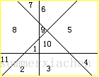

# 直线切割平面问题

## Reference：

- [平面分割_xzx9的博客-CSDN博客_平面分割空间](https://blog.csdn.net/weixin_43184669/article/details/115351729)
- [平面分割类问题总结 - Yeader - 博客园 (cnblogs.com)](https://www.cnblogs.com/fu3638/p/8384104.html)

## Detail：

### 【题型一】直线分割平面 

> 在一个平面上有一个圆和n条直线，这些直线中每一条在圆内同其他直线相交，假设没有3条直线相交于一点，试问这些直线将圆分成多少区域。 

分析： 
当添加第N条，为了使平面最多， 则第N条直线要与前面的N-1条直线都相交，且没有任何三条直线相交一个点。 
则添加第N条直线会多N-1个交点。同时：由于每增加N个交点，就增加N+1个平面，所以添加的第N条直线来会在之前的基础上增加N个平面。

若用F[i]表示i条直线能把平面切分成的个数。
$$
\begin{aligned}
F(1)&=2;\\
F(n)&=F[n-1]+n;
\end{aligned}
$$

可得递推结果：
$$
F(n)=1+n*(n+1)/2
$$

### 【题型二】平面分割空间（[HDU 1290](http://acm.hdu.edu.cn/showproblem.php?pid=1290)）

$$
F(n)=(n^3+5n)/6+1
$$

全面考虑，注意平面是可以倾斜的！

### 还有更多？

【题型三】折线分割平面（[HDU 2050](http://acm.hdu.edu.cn/showproblem.php?pid=2050)）

【题型四】圆形划分区域

