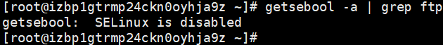
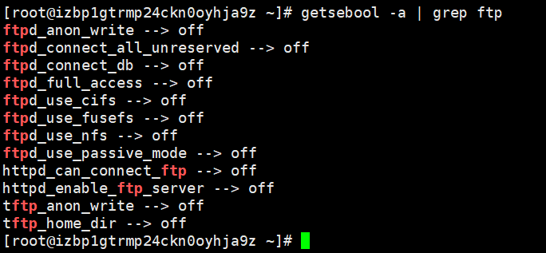
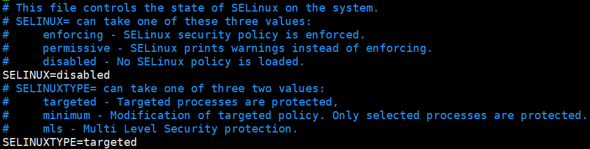

# 建立一个 FTP 服务器吧！

> 注意你所购买的云服务商的文档，
>
> 比如这里的：
>
> > - 主动模式：放通端口 21。
> > - 被动模式：放通端口 21，及 [修改配置文件](https://cloud.tencent.com/document/product/213/10912#config) 中设置的 `pasv_min_port` 到 `pasv_max_port` 之间的所有端口，本文放通端口为 40000 - 45000。
> >
> > [云服务器 Linux 云服务器搭建 FTP 服务-最佳实践-文档中心-腾讯云 (tencent.com)](https://cloud.tencent.com/document/product/213/10912)
>
> **Install vsftpd**
>
> ```
> # Install
> sudo apt update
> sudo apt install vsftpd
> sudo cp /etc/vsftpd.conf /etc/vsftpd.conf.orig
>
> # Firwall rules
> sudo ufw allow ftp-data
> sudo ufw allow ftp
> sudo ufw status
>
> # Preparing Space for Files
> sudo mkdir -p mapftp
> sudo chown nobody:nogroup mapftp
> echo "vsftpd test file" | sudo tee mapftp/test.log
> sudo mkdir mapftp/maps/
> sudo chmod a+rwx mapftp/maps/
> ```
>
> **Configure Anonymous Access**
>
> - Edit /etc/vsftpd.conf
> - Change the following:
>
> 1.  `anonymous_enable=YES` to allow anonymous access
> 2.  `write_enable=YES` to enable uploading
> 3.  `anon_upload_enable=YES` to enable anonymous uploading
> 4.  `anon_mkdir_write_enable=YES` to enable anonymous directory creation
>
> - Append the following to the end: 1.`anon_umask=022` so that new file will be readable by groups and other users. Uploaded files will have a permittion set to the value of `file_open_mode` (by default, 0666) subtracted by `anon_umask`.
>
> 1.  `anon_other_write_enable=YES` to enable anonymous deletion and renaming
> 2.  `anon_root=xxx/mapftp` sets the root folder for anonymous logins
> 3.  `no_anon_password=YES` stops prompting for a password on the command line.
> 4.  `hide_ids=YES` shows the user and group as `ftp:ftp`, regardless of the owner.
> 5.  `pasv_min_port=40000` and `pasv_max_port=50000` limits the range of ports that can be used for passive FTP
>
> - Optionally changes the listening port:
>
> 1.  `listen_port=` followed by port number
>
> **Conclusion**
>
> On Linux, use the ftp command to access the server, e.g. `ftp -p 192.168.0.2` then followed by `anonymous` as the username. On Windows, use Windows Explorer or other FTP tools.

## 了解 FTP

### 什么是 ftp？

FTP 即：File Transfer Protocol，即 ftp，可以直译为**“文件传输协议”**。但是由于 FTP 本身是使用明文进行数据传输，所以有了更多加密版本的 FTP 协议如：FTPS(FTP over SSL)，SFTP：Secure FTP(FTP over SSH)等

## 部署 FTP 服务器

### 以 windows 作为服务端——<a href="#filezilla">filezilla</a>实现

推荐视频教程：[FileZilla：如何快速搭建 FTP 服务器](https://www.bilibili.com/video/BV1xv411k7Lj?from=search&seid=6077142084469792314&spm_id_from=333.337.0.0)

1. Filezilla Sever 只支持 Windows 平台，而 Client 同时支持 Windows，Linux，Mac

2. 设置 Filezilla 时需要注意：你添加的 Port 不是实际使用时的端口，是管理端口，所以不论设为什么值，只要不和当前系统已有端口重合都是可以的

3. Filezilla 使用多用户管理机制，不过你在正式使用之前需要先创建用户。在`Edit-User-general`中创建

   - 这个单个用户并不意味着是单个自然人，多个人是可以共享一个用户名和密码的，这里的用户主要是用于区分访问种类与权限而非界定访问的实际个人
   - 用户与用户之间可以设置不同目录来访问不同的资源：`shared folders`中管理，但是每一个用户都需要一个根目录
   - 当你添加一个非根目录的时候，需要手动指定它在访问时所在的目录——即电脑本地的文件路径和访问到的文件路径并不是不统一的。但是根目录是无需指定路径的，或者说根目录的路径是`/`
   - 注意用户的权限管理，记得设置用户密码

4. home 会占用网址的路径，它不需要指定路径，对于 home 外的目录，添加之后，需要指定新的路径

   - 需要注意的是，ftp 服务中的添加的目录与本机文件的实际目录是可以没有关系的

      例如，对两个同级目录，你可以将一个目录赋在另一个目录的路径的子路径中

   - 配置路径地址时，注意使用反斜杠

### 以 Linux 作为服务端——vsftpd 实现

#### 在云服务器上部署 ftp 服务

这里采用了阿里云服务器的 CentOS7 系统，版本是 7.6

使用了常用的 vsftpd 包来搭建 ftp 服务

vsftpd 项目地址：[vsftpd - Secure, fast FTP server for UNIX-like systems (security.appspot.com)](https://security.appspot.com/vsftpd.html)

:::warning

##### 安装 ftp 服务

请注意，本文可能仅适用于 CentOS，其他的 Linux 发行版与 CentOS 虽同为 Linux 系统，但是也有诸多不同

例如，第 5 步需要修改的 vsftpd.conf 文件，CentOS 系统下它会出现在 /etc/vsftpd 文件夹下，而 Ubuntu 系统下它则会直接出现在 /etc 文件夹下

如果你需要以本教程做参考的话，请不要照搬本教程。比如将 CentOS 的包管理工具 yum 替换为你当前 Linux 发行版下的包管理工具

:::

1. 安装 vsftpd

```bash
yum install -y vsftpd
```

2. 设置 vsftpd 开机启动

```bash
systemctl enable vsftpd
```

3. 启动 vsftpd 服务

```bash
systemctl start vsftpd
```

4. 检验服务是否启动

```bash
netstat -antup | grep ftp
```

##### 配置 vsftpd

###### <span id="usernameAndCode">建立用户并为他配置用户专属文件夹</span>

1. 执行以下命令，为 FTP 服务创建一个 Linux 用户，本文以 ftpuser 为例。

   ```bash
   useradd ftpuser
   ```

   当你创建了一个新的用户的时候，Linux 回味这个用户在 `/home` 目录下建立一个以用户名为名的文件夹，并且这个目录这就是此后用户登陆时的默认路径 `~`所代指的路径

2. 执行以下命令，设置 `ftpuser` 用户的密码。

   ```bash
   passwd ftpuser
   ```

   输入密码后请按 Enter 确认设置，密码默认不显示，本文以 JBRBunjie 为例。

3. 执行以下命令，创建 FTP 服务使用的文件目录，本文以/var/ftp/test 为例。

   ```bash
   mkdir /var/ftp/test
   ```

   :::tip

   事实上，这个目录是哪里都可以的。只是一定要记得这个目录路径是什么，因为这个路径过会儿是会写入配置文件的。当客户机访问服务器时，实际地址就是这个地址

   :::

4. 执行以下命令，修改目录权限。

   ```bash
   chown -R ftpuser:ftpuser /var/ftp/test
   ```

   > 你也可以直接新开一个终端，并以 ftpuser 身份登录
   >
   > 这样子可以省去很多没必要的麻烦，因为在 ftpuser 身份下创建的所以文件的 owner 都是 ftpuser，就可以省略用户权限配置这一步

###### 修改 vsftpd.conf 配置文件，并设置 chroot

1. 打开要修改的文件：

   ```bash
   vim /etc/vsftpd/vsftpd.conf
   ```

2. 按`i`切换至编辑模式以修改配置文件 vsftpd.conf：

> 注意：
>
> FTP 可通过主动模式和被动模式与客户端机器进行连接并传输数据。由于大多数客户端机器的防火墙设置及无法获取真实 IP 等原因，一般选择**被动模式**搭建 FTP 服务。以下修改以设置被动模式为例，如需选择主动模式，可以参看腾讯云的文档：[设置 FTP 主动模式](https://cloud.tencent.com/document/product/213/10912#port)。

3. 修改以下配置参数，取消它们前面的`#`注释或者修改对应值，和本地用户的登录权限，设置指定例外用户列表文件的路径，并开启监听 IPv4 sockets。

   ```bash
   # Allow anonymous FTP? (Beware - allowed by default if you comment this out).
   # 是否运行匿名用户登录
   anonymous_enable=NO

   # Uncomment this to allow local users to log in.
   # When SELinux is enforcing check for SE bool ftp_home_dir
   # 取消此注释来运行本地用户登录
   local_enable=YES

   # You may specify an explicit list of local users to chroot() to their home directory. If chroot_local_user is YES, then this list becomes a list of users to NOT chroot(). (Warning! chroot'ing can be very dangerous. If using chroot, make sure that the user does not have write access to the top level directory within the chroot)
   # 如果两个配置项都为yes，那么, 凡是加在文件chroot_list中的用户都是不受限止的用户，即, 可以浏览其主目录的上级目录.
   # 如果不希望某用户能够浏览其主目录上级目录中的内容,可以如上设置,然后在文件vsftpd.chroot_list中去掉或不添加该用户即可。

   # 也可以如下配置
   # chroot_local_user＝NO
   # chroot_list_enable=YES(这行必须要有, 否则文件vsftpd.chroot_list不会起作用)
   # 则所有用户都能够访问上级目录，你可以把所有不希望有这种浏览其主目录之上的各目录权限的用户添加到文件chroot_list中即可(一行一个用户名，此时, 在该文件中的用户都是不可以浏览其主目录之外的目录的)
   chroot_local_user=YES
   chroot_list_enable=YES
   # chroot_list路径
   chroot_list_file=/etc/vsftpd/chroot_list

   # When "listen" directive is enabled, vsftpd runs in standalone mode and
   # listens on IPv4 sockets. This directive cannot be used in conjunction
   # with the listen_ipv6 directive.
   # 监听IPv4 sockets
   listen=YES
   ```

4. 在`listen_ipv6=YES`行首添加`#`来将此功能注释掉

   ```bash
   # This directive enables listening on IPv6 sockets. By default, listening
   # on the IPv6 "any" address (::) will accept connections from both IPv6
   # and IPv4 clients. It is not necessary to listen on *both* IPv4 and IPv6
   # sockets. If you want that (perhaps because you want to listen on specific
   # addresses) then you must run two copies of vsftpd with two configuration
   # files.
   # Make sure, that one of the listen options is commented !!

   # 关闭监听 IPv6 sockets。
   # listen_ipv6=YES
   ```

5. 添加以下配置参数，开启被动模式，设置本地用户登录后所在目录，以及云服务器建立数据传输可使用的端口范围值

   ```bash
   local_root=/var/ftp/test
   allow_writeable_chroot=YES
   pasv_enable=YES
   pasv_address=xxx.xx.xxx.xx #请修改为您的 Linux 云服务器公网 IP
   pasv_min_port=40000
   pasv_max_port=45000
   ```

   按 `Esc` 后输入 `:wq!` 保存后退出。

6. <span id="continue-steps">创建`chroot_list`文件</span>

   ```bash
   vim /etc/vsftpd/chroot_list
   ```

   - 按 **i** 进入编辑模式，输入用户名，一个用户名占据一行，

   - 设置完成后按 **Esc** 并输入 **:wq** 保存后退出。

   - 您若没有设置例外用户的需求，可跳过此步骤，输入 **:wq** 退出文件。或者直接改用 `touch` 命令来创建文件

7. 重启 FTP 服务。

   ```bash
   systemctl restart vsftpd
   ```

##### 设置云服务器安全组

增加新的策略：

1. 开放 ftp 21 端口
2. 开放你在 vsftpd.config 中所配置的端口范围(pasv_min_port - pasv_max_port) 40000 - 45000

示例：


:::tip

如果你使用的不是云服务器，你只需要将本地的防火墙指定端口打开就行

:::

##### 验证 FTP 服务

您可通过 FTP 客户端软件、浏览器或文件资源管理器等工具验证 FTP 服务。

1. 打开客户端的 IE 浏览器，选择【工具】>【Internet 选项】>【高级】，根据您选择的 FTP 模式进行修改：

   - 主动模式：取消勾选【使用被动 FTP】

   - 被动模式：勾选【使用被动 FTP】

     

2. 打开计算机的 ftp 客户端，如果是 windows 电脑可以直接使用`file explorer`，在路径栏中访问"ftp://xxx.xxx.xxx.xxx（你服务器的地址）"

3. 在弹出的“登录身份”窗口中输入 <a href="#usernameAndCode">配置 vsftpd</a> 中已设置的用户名及密码。本文使用的用户名为 `ftpuser`，密码为 `JBRBunjie`

4. 成功登录后，即可上传及下载文件

#### 更进一步：为多用户配置不同根目录

~~埋坑~~

**总之仍然是对 vsftpd 配置文件进行修改来实现**

---

## 踩坑集合

### Linux 系统环境下

#### 550 No such file or directory / 550 create directory operation failed

查看当前用户：

如果你能连上远程地址，但是根本看不到文件内容，并且当你输入正确密码时仍然报错：550

建议排查的东西：

- 你配置的目录是否正确：`/etc/vsftpd/vsftpd.conf` 中的 `local_root` 是否是你实际配置的目录

- `ftpuser` 是否拥有操作当前 `local_root=/var/ftp/test` 目录及内层文件的权限

  ```bash
  ls -l [option: existed folder in current menu]
  ```

- 服务是否启动

  ```bash
  netstat -antup | grep ftp
  ```

- 修改了配置项但还没有重启服务

  ```bash
  systemctl restart vsftpd
  ```

- 检查 SELinux 服务：

  ```bash
  getsebool -a | grep ftp
  ```

  如果这条语句的结果是

  

  代表 SELinux 安全服务处于 disabled 状态，不是这里的错，大概率还是上面四条错误

  但是如果是下面这样



 ——几乎所有与 ftp 相关的服务都被关闭掉了

 那几乎可以肯定是在这里出错了

 解决办法是修改/etc/selinux/config 配置文件：

```bash
vim /etc/selinux/config
```

 把`SELINUX`默认的`permissive`或`enforcing`改为`disabled`



:::tip

什么是<a href="#SELinux">SELinux</a>？

Security-Enhanced Linux (SELinux) is a security architecture for <a href="#what-is-linux">Linux® systems</a> that allows administrators to have more control over who can access the system. It was originally developed by the United States National Security Agency (NSA) as a series of patches to the <a href="#linux-kernel">Linux kernel</a> using Linux Security Modules (LSM).

SELinux was released to the open source community in 2000, and was integrated into the upstream Linux kernel in 2003.

> " SELinux(Security-Enhanced Linux) 是美国国家安全局（NSA）对于强制访问控制的实现，是 Linux 历史上最杰出的新安全子系统 "

:::

- 最后办法：重启计算机，因为你之前修改的配置文件可能并没有生效

#### 553 Could not create file

解决方法

1. 执行以下命令，检查服务器磁盘空间的使用率。

   ```bash
   df -h
   ```

   - 如果磁盘空间不足，将会导致文件无法上传，建议删除磁盘容量较大的文件。
   - 如果磁盘空间正常，请执行下一步。

2. 执行以下命令，检查 FTP 目录是否有写的**权限**。

   ```bash
   ls -l /home/test
   # /home/test 为 FTP 目录，请修改为您实际的 FTP 目录。
   ```

   - 若返回结果中没有 `w`，则表示该用户没有写的权限，请执行下一步。
   - 若返回结果中已有 `w`，(⊙﹏⊙)，那我建议你重装系统（

3. 执行以下命令，对 FTP 目录加上写的权限。

   ```bash
   chmod +w /home/test
   # /home/test 为 FTP 目录，请修改为您实际的 FTP 目录。
   ```

4. 执行以下命令，重新检查写的权限是否设置成功。

   ```bash
   ls -l /home/test
   # /home/test 为 FTP 目录，请修改为您实际的 FTP 目录。
   ```

### 设置 FTP 主动模式

主动模式需修改的配置如下，其余配置保持默认设置：

```bash
anonymous_enable=NO      #禁止匿名用户登录

local_enable=YES         #支持本地用户登录

chroot_local_user=YES    #全部用户被限制在主目录
chroot_list_enable=YES   #启用例外用户名单
chroot_list_file=/etc/vsftpd/chroot_list  #指定用户列表文件，该列表中的用户不被锁定在主目录

listen=YES               #监听IPv4 sockets

#在行首添加#注释掉以下参数
#listen_ipv6=YES         #关闭监听IPv6 sockets

#添加下列参数
allow_writeable_chroot=YES
local_root=/var/ftp/test #设置本地用户登录后所在的目录
```

按 **Esc** 后输入 **:wq** 保存后退出，并前往<a href="#continue-steps">这里</a>>继续完成 vsftpd 配置。

## 参考资料：

### 部分资源与拓展阅读

- [FileZilla - The free FTP solution (filezilla-project.org)](https://filezilla-project.org/)
- <span id="SELinux">[What is SELinux? (redhat.com)](https://www.redhat.com/en/topics/linux/what-is-selinux)</span>
- <span id="what-is-linux">[What is Linux? (redhat.com)](https://www.redhat.com/en/topics/linux/what-is-linux)</span>
- <span id="linux-kernel">https://www.redhat.com/en/topics/linux/what-is-the-linux-kernel</span>

### 进一步配置方向：

- 添加用户与用户组并分配不同权限
