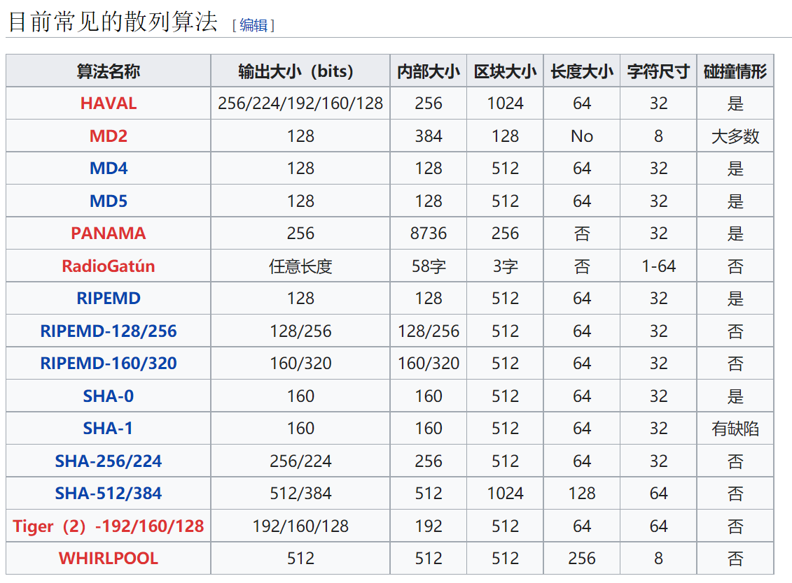
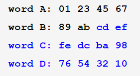
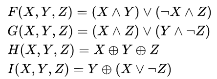

# 简明Hash function教程

:::waring

请注意！这篇文档是关于散列函数Hash function的，如果需要了解Hash table相关内容请查阅“简明Hash table教程”等相关文章

:::

## 引子

在各种下载站的资源页面下方，经常会有如下以SHA开头的特殊字段

> **SHA1：**9B71AD5604B3816BCC7E9AFA3052AE7D823163E8

或者是或MD5开头的特殊字段

> MD5：124756ef340daf80196b4124686d651c

这些特殊字段既非下载链接，也特定网址。那么这些特殊的字段都有什么用？

想要解决这个问题，我们需要先了解一下什么是Hash算法

## Hash算法
### 什么是Hash？

先简单介绍一下Hash算法

> [散列函数](https://zh.wikipedia.org/wiki/散列函数)（Hash function）又称散列算法、哈希函数，是一种从任何一种数据中创建数字“指纹”的方法。

:::tips

请注意！Hash算法并非特指某一种算法，而是所有满足Hash算法的一整类算法的统称

:::

Hash算法的实际效果为：对任意一组输入数据进行计算处理，并最终得到一个固定长度的输出摘要。

经典的比如经MD5算法运算后的结果只有16位或者32位16进制字符，而SHA-1的结果为40位16进制字符

### 试着去生成一个Hash Code与Hash算法的基本应用

现在打开你的任何一款ide，通过MD5方法来对`你好啊`这串字符进行处理，如下是Python对之进行处理的例子

```python
import hashlib
str1 = "你好呀" # 准备Hash算法需要处理的数据块
m = hashlib.md5() # 确定特定的Hash算法
m.update(str1.encode("utf8")) # 执行该算法
print(m.hexdigest(), type(m.hexdigest())) # 查验输出结果
```

检查一下结果：`4f65fdb33e0f2bd0de6bd1b41fdea968 <class 'str'>`——一个32个字符，32Byte，128bit大小的字符串，和MD5算法规定的长度完全一致

而当你的对应数据和具体算法确定以后，不管你是在本地，还是在别的任何设备上再次执行这串代码，它的结果是不会发生变化的。也就是说，一个特定的输入在既定的Hash算法中只会对应一个特定的输出

根据这个特点，我们可以用某种特定的Hash算法来检验资源的完整性：当用户完成资源的下载后，如果本地资源使用对应的Hash算法得到的Hash code与下载网站上给出的Hash code不相符的话，就意味着你的本地资源有问题，需要进行修复或者重新下载

### Hash算法还能干什么？

事实上，Hash Code被大量使用于网站的密码加密中：当用户注册的时候，用户的密码通过某种Hash算法加密后得到一串Hash Code，服务器就将Hash Code代替明文密码存储到服务器的数据库中，用户登陆时输入的密码经过加密会再次得到相同的结果，这当然与数据库中存储的内容一致，这样子就完成了用户的验证。

由于Hash算法总是进行<a href="#progress">有损的压缩运算</a>，并且在实时的运算中损失了大部分原始数据，使得到原数据最直接的方式只有再次输入，想要破解一般只能够依靠穷举。故一般认为Hash算法是不可逆运算，所以即便是服务器数据库泄露也不必担心账号被别人盗取

### 尝试使用Hash算法，并研究它的输出规律

为了研究Hash算法的输出结果的规律，我们需要几个实例

```java
public class HelloWorld {
    public static void main(String []args) {
		System.out.println("hello, java".hashCode());
		System.out.println("hello, java".hashCode()); //相同数据输入，查看结果
        
        System.out.println("---------------------------");
		
		System.out.println("hello, jav".hashCode());
		System.out.println("hello, java".hashCode());
		System.out.println("hello, javav".hashCode());
		System.out.println("AaAaA".hashCode());  
		System.out.println("AaAaAa".hashCode());
		System.out.println("AaAaAaA".hashCode()); // 不同数据输入，查看结果
		
        System.out.println("---------------------------");
		
		System.out.println("AaAaAa".hashCode());
		System.out.println("BBAaBB".hashCode()); // 仍然是不同数据输入，再次查看结果
    }
}

/* outputs：
2057144552
2057144552 // 相同的输入经过散列表算法运算后得到了相同的输出
---------------------------
-1596208487
2057144552
-653028210
62984129
1952508096
398208897 // 不同的输入“理所当然”地得到了完全不同的输出
---------------------------
1952508096
1952508096 // 不同的输入居然得到了相同的输出！
*/
```

从以上实例中我们可以发现虽然一般的不同字符经过运算后输出的结果是不同的，但是也存在不同字符串在经过运算后得到了相同的输出

特别地，我们将这种两个不同的输入值经过运算后得到了相同的输入值的情况称作是**“Hash collision”**

需要指出的是，发生collision并不可怕，当一个更大的数据集被映射到一个更小的数据集或容器时，一定会出现多对一的情况，这是一件不可避免的事，而算法的优劣只取决于出现collision的频率如何。如果collision出现频次过高，那么就意味着这个Hash算法生成的Hash Code可以在较短时间内被别人使用穷举等办法来破解其内容——也就是说，它不安全，所以用户需要设置更长更复杂组合的密码，而服务器需要使用更不容易被破解的Hash算法~~`或者对MD5加盐`~~。

一般来讲**输出大小**越长的算法，安全性也就越高。只有安全度足够高的Hash算法，即没有任何人能够成功实现碰撞的哈希，才有资格被考虑用在加密场合



在**极限情况**下，传统的MD5算法可以保证最多340282366920938463463374607431768211456个数据与结果的一一对应，而SHA-1算法甚至可以保证最多1461501637330902918203684832716283019655932542976个数据，但是由于计算机算力的进步，算法自身的缺陷，现呈的彩虹表等的诸多原因存在，它们已经可以在短时间内被破解，为了保证数据的安全，我们需要使用更安全的Hash算法如SHA-2系列的Hash算法来做数据加密

## 总结：

1. 什么是Hash算法？

   + Hash算法，一般译为哈希算法，摘要算法或者散列算法，它的作用是：对任意一组输入数据进行计算，得到一个固定长度的输出摘要。
2. 哈希算法的特点？
   - 相同的输入一定得到相同的输出；
   - 不同的输入大概率得到不同的输出。

3. 哈希加密的作用：
   + 完整性校验：MD5，SHA-1
   + 数据加密：SHA-2系列等


`附录`

### <span id="progress">Hash算法是怎么实现的？</span>

Hash算法原理大同小异，大体上的流程包括对原数据块进行切片，再对切片进行细分，并利用每一细分小组的内容按预设算法进行破坏式压缩处理来得到最终的结果，下面以MD5算法为例介绍Hash算法流程

#### MD5算法的原理：

##### 原理概述：

MD5算法先对数据块填充，将不合规的数据标准化。然后进行分组，标准是每512bit为大小分一组。在每一个分组中又进一步划分出16个32位的子分组。设立四个<a href="#variable">标准幻数</a>，定义四个非线性函数，一个大小为64的常数数组，一个大小为64的位移常量数组。

在计算过程中，根据512位分组的数据进行外循环，在这之中利用每个细分小组进行一轮16次循环一共4轮合64次的内循环。

在单次内部循环中，根据正在进行的轮次运用四个非线性函数中的一个对子分组进行的数据进行处理，将处理的结果与标准幻数相加，并进行下一次循环。当主循环完成时，原标准幻数就与数据紧密联系起来，把所有标准幻数组合到一起，这就是一个基于MD5算法的Hash Code

> <span id="variable">什么是幻数？</span>
>
> 不同领域对于幻数这一名称有不同的定义，而MD5中的幻数其实就是在算法中被预设的4个32位的整数，对于一个128位的MD5 Hash Code来说，由4个32位的整数结果彼此组和来得到最终结果貌似是一个不错的选择，而这4个结果就是由这4个标准幻数A,B,C,D根据数据块的内容按照预定算法经过不断演变得到的

实际使用的标准幻数：

```python
A = 0x67452301
B = 0xEFCDAB89
C = 0x98BADCFE
D = 0x10325476 
```

注意，其实这四个标准幻数和ABCD四个字母全无关系，实际生效的只是他们后面的变量值，而这四个值只是被算法规定如此而已~~`也许这也算是一种另类的私货？`~~

##### 流程介绍：

1. ###### 填充

首先将原数据进行补长（长度的度量是bits）到一个对512取模的结果为448的数，在补长的过程中，我们先在原数据末尾append "1" bit to message，然后再append "0" bits until message length in bits ≡ 448 (mod 512)

完成了补长之后，利用最后的64位（512-448=64）来记录**填充前**的长度(append original length in bits mod 2^64^ to message)

当上述两个操作都完成以后，数据的总长度就是512的倍数了

一定要补长(64+1~512)，内容为100…0（如若消息长448，则填充512+64）

2. 计算

首先把结果分割为N个512位的块：Y0，Y1，…（每一个512位块再细分为16个32比特子组） 

每个块都进行一次循环，在当前循环中，我们将整个块再次细分为16个32位的子块


在正式开始循环之前，我们还需要这些东西：

+ 设立四个标准幻数




​	虽然无需考究这四个数字的16进制内容有什么含义，但是规律明显得让人不禁发笑

​	我们分别以ABCD为名设立四个32位的整数变量，A=0x67452301,B=0xefcdab89,C=0x98badcfe,D=0x10325476，这就是实际使用到的标准幻数

+ 定义四个非线性函数：

   

+ 定义常量数组(正弦函数表)：

  ```python
  for i in range(0, 64)
      k[i] = math.floor(math.fabs(math.sin(i + 1)) * (2 ** 32))
  # 或者直接赋值：
  k = [
       0xd76aa478, 0xe8c7b756, 0x242070db, 0xc1bdceee, 0xf57c0faf, 0x4787c62a, 0xa8304613, 0xfd469501,
        0x698098d8, 0x8b44f7af, 0xffff5bb1, 0x895cd7be, 0x6b901122, 0xfd987193, 0xa679438e, 0x49b40821,
        0xf61e2562, 0xc040b340, 0x265e5a51, 0xe9b6c7aa, 0xd62f105d, 0x02441453, 0xd8a1e681, 0xe7d3fbc8,
        0x21e1cde6, 0xc33707d6, 0xf4d50d87, 0x455a14ed, 0xa9e3e905, 0xfcefa3f8, 0x676f02d9, 0x8d2a4c8a,
        0xfffa3942, 0x8771f681, 0x6d9d6122, 0xfde5380c, 0xa4beea44, 0x4bdecfa9, 0xf6bb4b60, 0xbebfbc70,
        0x289b7ec6, 0xeaa127fa, 0xd4ef3085, 0x04881d05, 0xd9d4d039, 0xe6db99e5, 0x1fa27cf8, 0xc4ac5665,
        0xf4292244, 0x432aff97, 0xab9423a7, 0xfc93a039, 0x655b59c3, 0x8f0ccc92, 0xffeff47d, 0x85845dd1,
        0x6fa87e4f, 0xfe2ce6e0, 0xa3014314, 0x4e0811a1, 0xf7537e82, 0xbd3af235, 0x2ad7d2bb, 0xeb86d391
  ]
  ```
  

> 和为什么标准幻数被定义成那样子一样，解释为什么常量数组是这些东西的理由也只有“它是被定义成这样子的”。不过常量数组有一个优势：我们可以了解这些数字具体是怎么来的：
>
> 你应该已经看见了定义常量数组的第一种（即利用正弦函数实时生成的）办法，这就是这些数据产生的来源。

+ 定义位移常量:

  ```python
  # md5转换用到的常量，数据都是算法本身规定的
  r = [
      7, 12, 17, 22,  7, 12, 17, 22,  7, 12, 17, 22,  7, 12, 17, 22,
  	5,  9, 14, 20,  5,  9, 14, 20,  5,  9, 14, 20,  5,  9, 14, 20,
  	4, 11, 16, 23,  4, 11, 16, 23,  4, 11, 16, 23,  4, 11, 16, 23,
  	6, 10, 15, 21,  6, 10, 15, 21,  6, 10, 15, 21,  6, 10, 15, 21
  ]
  ```

> 事实上：所有常量都是经由算法规定的，毕竟只有经过被“规定”的步骤才能保证结果的一致性

循环计算

循环分为内层和外层，外层是对512块进行循环，内层则对32位子块进行循环

每次外层循环中，我们共会进行四轮内层循环，每次内层循环我们都会按顺序对单个32位子块进行处理

```python
for i in outside: # 外层循环
    for t in range(0, 64): # 内层总循环
        if 0 ≤ i ≤ 15:
            f = (b & c) | (~b & d) # 临时变量f，实际上是存储了当前轮次的非线性函数的结果
            g = i # 存储当前轮次下的第几次
        else if 16 ≤ i ≤ 31:
            f = (d & b) | ((~d) & c)
            g = (5×i + 1) % 16
        else if 32 ≤ i ≤ 47:
            f = b ^ c ^ d
            g = (3×i + 5) % 16
        else if 48 ≤ i ≤ 63:
            f = c ^ (b | (~ d))
            g = (7×i) % 16
        temp = d
        d = c
        c = b
        b = ((a + f + k[i] + w[g]) << r[i]) + b
        # w[g]是当前顺序下的32位数据子块,k[i]是我们已经生成好的常量数组,r[i]则是当前轮次所使用到的左移量
        a = temp
    A = A + a
    B = B + b 
    C = C + c
    D = D + d
```

每次：一个输入128位，另一个输入512位，结果输出128位，用于下一轮输入 

4. 结果

```python
digest = str(A) + str(B) + str(C) + str(D)
```

 //最后一步的输出即为散列结果，共128位。

又如SHA-1等算法原理与MD5大同小异，主要的变化之处在于：增加初始的标准幻数个数，增加循环轮数与参与范围，改变变换的非线性函数等


