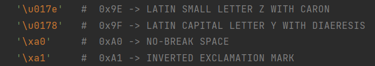

# 计算机编码梳理

## ASCII码

### 描述

这是计算机编码发展历程里的第一阶段：ASCII码，即：`American Standard Code for Information Interchange`，美国信息交换标准代码

#### 设计思路：

在计算机内部存储单元的最小单位时Byte。不过Byte仍然可以细分：每一个二进制位是一个bit，有0和1两种状态。8个bit构成一个byte——所有的信息最终都表示为一个二进制的字符串。

在这个基础上，如果利用0和1各代表一个状态，由于一个byte有8个bit，故总共可以表示2的8次方＝256个状态。若是每个状态对应一个符号，一个byte可以表示256个符号，也就是从0000000到11111111。

根据这个思路，美国在上个世纪60年代制定了一套字符编码，用于安排控制字符、英语字符、数字等符号与二进制位之间对应的关系，形成了大名鼎鼎的ASCII码。

但ASCII码一共只规定了128个字符的编码，比如空格"SPACE"是32（二进制00100000），大写的字母A是65（二进制01000001）。这128个符号（包括32个不能打印出来的控制符号），只占用了一个字节的后面7位，而由于使用了8位二进制，故规定最前面的第一位二进制数则为0。

>  可以访问：[ASCII Code - The extended ASCII table (ascii-code.com)](https://www.ascii-code.com/)了解

#### 现状：

时至今日，仍然有很多语言采用这一编码作为默认编码，比如Python2等语言

> `Python2的 默认编码是ASCII，不能识别中文字符，需要显式指定字符编码；`
> `而Python3的默认编码改为了Unicode，可以识别中文字符`

采用ASCII编码主要的字符集：Windows-1252字符集、ISO8859-1字符集

### ASCII实现思路

- 所有的控制字符(比如CR回车、DEL删除等)编码在0-31范围以及127中。
- 把所有的标点符号，英文大小写全部放在32-126范围中。

### ASCII实现形式

- 0xxxx xxxx

### 示例

```java
String str = new String("华侨永亨银行");
// 采用UTF-8编码得到字节数组
byte[] bytes = str.getBytes("UTF-8");
// bytes: {e5 8d 8e e4 be a8 e6 b0 b8 e4 ba a8 e9 93 b6 e8 a1 8c}
// 注意第二个字节0x8d，在下面的编解码中被自动转换成了3f

// 采用Windows-1252解码得到字符串
str = new String(bytes, "Windows-1252");
// 采用windows-1252编码，还原字节数组
bytes = str.getBytes("Windows-1252");
// bytes: {e5 3f 8e e4 be a8 e6 b0 b8 e4 ba a8 e9 93 b6 e8 a1 8c}

// 采用UTF-8解码，预期得到原字符串
str = new String(bytes, "UTF-8");
// str: ???侨永亨银行,第一个字被永久性破坏
// 引自：https://blog.csdn.net/zou8944/article/details/79859112
```

> 不过，这个例子对Python不生效，因为python取了个巧:
>
> 
>
> 


## GB2312&GBK

### 说明

英语用128个符号编码就够了，但是用来表示其他语言，128个符号是不够的。

以中文为例，汉字有10万左右，即使是常用字也有六七千，必须得用多个字节来表示。

最先诞生的是GB2312编码。对于该编码，我们只需要明白以下两点：

- 该编码可以表示大概7000左右个字符。其中有中文及一些常见的拉丁字母等。基本可以覆盖我们日常打字使用。

- 该编码完全兼容ASCII码，计算机去读的时候首先判断最高位，如果是0，那么这个字符只占用一个字节，表示的内容跟ASCII码表示的一样。如果该字符最高位是1，那么该字节连同下一个字节表示一个中文汉字。所以平常咱们常说的英文一个字节，中文两个字节其实是从这里来的。

### GB2312实现形式

- 0xxxxxxx：表示为ASCII字符
- 1xxxxxxx 1xxxxxxx：表示为汉字

### 后来？

两个字节最多可以表示的字符数是 2^16＝65536，如果要求首位必须是1，那么最多可以表示 32768 个字符，但是GB2312 只用了其中的7000左右的字符。这显然是没有做到物尽其用，而且如果有些特殊的中文，GB2312根本表示不了。所以GBK就应运而生了。

GBK 就尽量将能用到的状态都表示成中文字符了，当然最终还是有些状态没办法用（具体可以自行查找文档），最终可以表示23940个字符，其中有21003是汉字。

GBK是完全兼容GB2312的，所以GBK的应用是很广泛的，而且从Windows95开始，Windows的中文版默认中文支持就是GBK编码。你可以通过在cmd下输入`chcp`命令来查看你当前系统的默认编码

> 在GBK后还有**GB18030**等，不再解释

### GBK实现形式：

+ 0xxxxxxx：表示为ASCII字符
+ 1xxxxxxx xxxxxxxx：表示为汉字

## Unicode

GBK基本解决了中文编码问题，但另外一个大问题随之而来，那就是国际化。

从我们的视角看，我们按照这种方式来表示简体中文和英文，成了是成了，可是繁体中文怎么表示？日文又怎么表示？

而又从他们的视角看，当然他们也利用最高位来做文章，发明了big5（台湾繁体），JIS（日文）等兼容ASCII码的编码格式，但是这几种编码之间是并不兼容的。一段GBK编码的文件在台湾友人的电脑里打开就是乱码了。

这时候，Unicode就诞生了。

[Unicode – The World Standard for Text and Emoji](https://home.unicode.org/)

完全弄明白Unicode的细节是非常困难的，我们也是明白以下几点就够了：

1. Unicode 只是一个符号集，它只规定了符号的二进制代码，却没有规定这个二进制代码应该如何存储。

2. Unicode 编码是给世界上所有的符号都分配了一个码。GBK最多也只能表示3万多的汉字，康熙字典里面的大部分汉字都没法用GBK表示，但是Unicode就能，它~~(大概)~~可以表示这个星球上所有的符号。
3. Unicode有UCS-2和UCS-4两种编码，2和4都是代表字节的意思，也就是说前者用两个字节表示，后者用4个字节表示。所以，UCS-2的表示范围是65536个字符，而UCS-4则可以表示超过22亿个字符，我想这真的是可以表示所有的字符了。其实日常使用我们用的只是UCS-2，一般说的Unicode编码也是只它。它包含了所有的简体中文，现用的繁体中文，火星文，以及其他国家的现用文字。古籍中的文字就得去UCS-4中去找了。

值得注意的是：Unicode中，中文的编码范围为4E00-9FCF，其中9FC4-9FCF之间的区间没有使用。

一个比较突出的问题就是这个区间全部都是文字，而中文标点没有包含在其中，反而散落在各个位置。同时，一些特殊的文字和中文部首以及一些特殊符号也不在此范围内，需要特别注意。

## UTF-8

### 说明

很遗憾，Unicode并不是完美的。不完美的地方主要有两点：

1）不兼容ASCII码。因为Unicode是用两个字节表示，ASCII码范围内的字符都被扩充成了两个字节，前面又补了8个0。所以，如果你的电脑只支持Unicode编码的话，所有的英文资料全都没法阅读了。

2）占用的存储变大，如果涉及到传输，所耗费的流量也会变大。中文文本还好，英文就相当明显。纯英文文本所消耗的存储比以前增大了一倍。

这个时候就出现了诸如UTF-8等实现方式。这里我们只讨论UTF-8，因为它是使用最广泛的。它弥补了Unicode的缺陷，同时主要有以下几个优点。

1. UTF-8与Unicode是一一对应的。所以UTF-8是国际化的编码方式。

2. UTF-8是针对Unicode的可变长度字符编码，最短一个字节，最长3个字节，1个字节表示的就是ASCII码，所以UTF-8是完全兼容ASCII码的。

3. 正是因为UTF-8的变长实现，解决了Unicode的存储多的问题。可能有朋友要问了，UTF-8最多需要用3个字节表示，而Unicode只需要两个，怎么能说UFT-8会省存储呢？因为目前英文是最通用的语言，大部分字符都是ASCII码。

但UTF-8并不是一点缺点也没有，因为变长表示，所以一段UTF-8编码没法一下子算出有多少个字符。而这一点能力对于以上几种编码格式来说是轻而易举的。所以当今世界上没有最完美的字符编码，只有最合适某个场景的编码。

### UTF-8具体实现

| 范围                                                         | 字节数 | 存储格式                                              |
| ------------------------------------------------------------ | ------ | ----------------------------------------------------- |
| 0x0000~0x007F (0 ~ 127)                                      | 1字节  | 0xxxxxxx                                              |
| 0x0080~0x07FF(128 ~ 2047)                                    | 2字节  | 110xxxxx 10xxxxxx                                     |
| 0x0800~FFFF(2048 ~ 65535)                                    | 3字节  | 1110xxxx 10xxxxxx 10xxxxxx                            |
| 0x10000~1FFFFFF(65536 ~ 2097152)                             | 4字节  | 11110xxx 10xxxxxx 10xxxxxx 10xxxxxx                   |
| 0x2000000~0x3FFFFFF                                          | 5字节  | 111110xx 10xxxxxx 10xxxxxx 10xxxxxx 10xxxxxx          |
| 0x4000000~0x7FFFFFFF)                                        | 6字节  | 1111110x 10xxxxxx 10xxxxxx 10xxxxxx 10xxxxxx 10xxxxxx |

## 番外：多字节编码的一些概念

### 大尾(big endian)和小尾(little endian)

大尾和小尾是CPU处理多字节数的不同方式。例如“汉”字的Unicode编码是6C49。那么写到文件里时，究竟是将6C写在前面，还是将49写在前面？如果将6C写在前面，就是big endian。还是将49写在前面，就是little endian。

### BOM

UTF-8以字节为编码单元，故没有字节序的问题。而UTF-16以两个字节为编码单元，在解释一个UTF-16文本前，首先要弄清楚每个编码单元的字节序。例如收到一个“奎”的Unicode编码是594E，“乙”的Unicode编码是4E59。如果我们收到UTF-16字节流“594E”，那么这是“奎”还是“乙”？

Unicode规范中推荐的标记字节顺序的方法是BOM，即Byte Order Mark。BOM是一个有点小聪明的想法：

在UCS编码中有一个叫做`"ZERO WIDTH NO-BREAK SPACE"`的字符，它的编码是`FEFF`。而`FFFE`在UCS中是不存在的字符，所以不应该出现在实际传输中。UCS规范建议我们在传输字节流前，先传输字符`"ZERO WIDTH NO-BREAK SPACE"`。这样如果接收者收到`FEFF`，就表明这个字节流是Big-Endian的；如果收到`FFFE`，就表明这个字节流是Little-Endian的。因此字符`"ZERO WIDTH NO-BREAK SPACE"`又被称作BOM。

UTF-8不需要BOM来表明字节顺序，但可以用BOM来表明编码方式。字符`"ZERO WIDTH NO-BREAK SPACE"`的UTF-8编码是`EF BB BF`（读者可以用我们前面介绍的编码方法验证一下）。所以如果接收者收到以`EF BB BF`开头的字节流，就知道这是UTF-8编码了。

不过话又说回来：理论上说，UTF-8并没有大小尾的困扰，所以并不需要BOM。但是一些Windows应用会指定大小尾，比如Notepad，而且Excel在没有指定BOM的UTF-8文件进行读取时会使用Windows的codepage，从而出现错误。 

