# Python 3 Basic Grammar Training

## 为什么是 python？

一个最重要的原因——简单，快速，容易上手：

你也可以通过著名的开发语言排行榜 TIOBE 来直观感受 Python 有多么热门[index | TIOBE - The Software Quality Company](https://www.tiobe.com/tiobe-index/)

### python 官网：[Welcome to Python.org](https://www.python.org/)

### python 社区（PYPI）：[PyPI · The Python Package Index](https://pypi.org/)

### python 最大的优势：开发效率高

### python 最大的劣势：运行效率低

~~开发效率与运行效率间的取舍是动态语言不可能绕过的问题，Python 选择了开发效率换运行效率。~~

~~但是 python 支持嵌入 c，c++等高效率的低级语言，可以在一定程度上缓解这个问题~~

## 配置你的电脑环境：

安装 Python 3.8（Python 会自带一个编辑器"IDLE"，不过只提供了基础的代码编写功能）

你可以通过我

关于 IDE，我会推荐推荐使用 Jet Brains 公司出品的 Pycharm。当然，宇宙第一 IDE——Visual Studio 也是不错的选择

> 关于 Python 的版本：
>
> Python3 中的更新与 c/c++的新标准，Java 的新版本等有相通之处；
>
> > 每次 Python 更新都会推出很多新的 feature，3.7 版本中更新了这些内容：https://docs.python.org/zh-cn/3.7/whatsnew/3.7.html，如果你需要了解当前版本更新了什么，最好的办法当然是去阅读Python的官方文档，当然，你也可以直接在Python自带的ide：idle来查阅Python的版本变化信息。在idle中，你可以按照Help >>> Python Docs >> What’s New In Python 3.7 的路径来查看
>
> 简单来说，python 的更新会添加新的语法，提升 python 的稳定性(一般)，少数情况下会删除旧的语法与功能~~（3.10 的兼容性差大概就是这么来的~~）
>
> ~~截止本文完成时，Python 已经推出了发布 3.11 版本的计划，并且已经推出了 Python3.11 的文档：[What’s New In Python 3.11 — Python 3.11.0a0 documentation](https://docs.python.org/3.11/whatsnew/3.11.html)~~

## 正式开始！

### 从命令行开始！

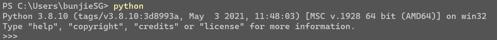

这时，cmd 就进入了 python 的编写模式，支持 python 当前版本的所有语法，和 python 自带的编辑器

> 当然，你也可以使用 windows 的 powershell，不过相对于 cmd 而言，powershell 更加复杂，而且有各种莫名其妙的限制

:::warning

注意，如果你在 cmd 中输入 python 后打开的是 windows 商店，这是你操作系统的环境变量出了问题，请在 edit the system environment variables 下仔细检查 Path 中 python 条目下的环境变量指向的地址！

:::

#### 现在尝试打印 Hello World 吧

所有你需要做的只是输入

```python
print("Hello World")
```

cmd 就会显示：

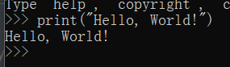

简单吧！相信你一定会爱上 python 这门简单的语言的

如果你要回到 cmd 的初始状态，只需要用 quit() 即可

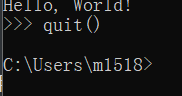


#### 什么时候需要使用到命令行？

比如我现在已经编写完成了一个基于 python 的脚本。在命令行中，我们甚至无需要进入 python 的编辑模式，只需输入 python + 文件路径即可直接执行。一般来说，启动一个 ide 是很耗费时间的，而这就是我们节约时间的手段。

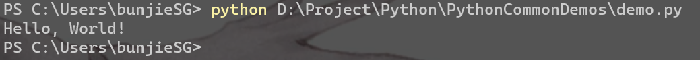

### 在 pycharm 中继续：

#### PyCharm 介绍

官网：[PyCharm: the Python IDE for Professional Developers by JetBrains](https://www.jetbrains.com/pycharm/)

至于为什么选用它，建议逼乎一下 😂

#### 新建项目

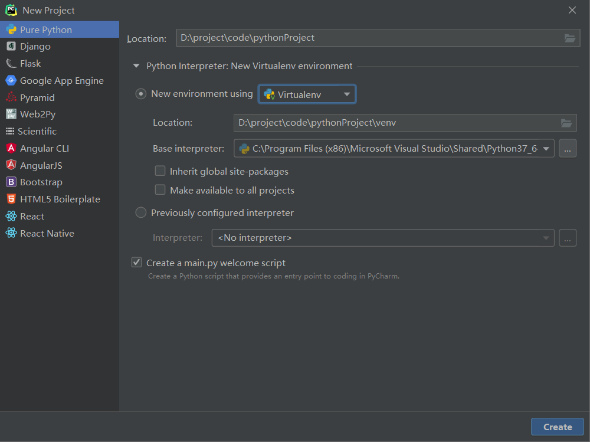

#### 对 pycharm 的一些初始设置：

1. 设置编码：（都改为 utf-8）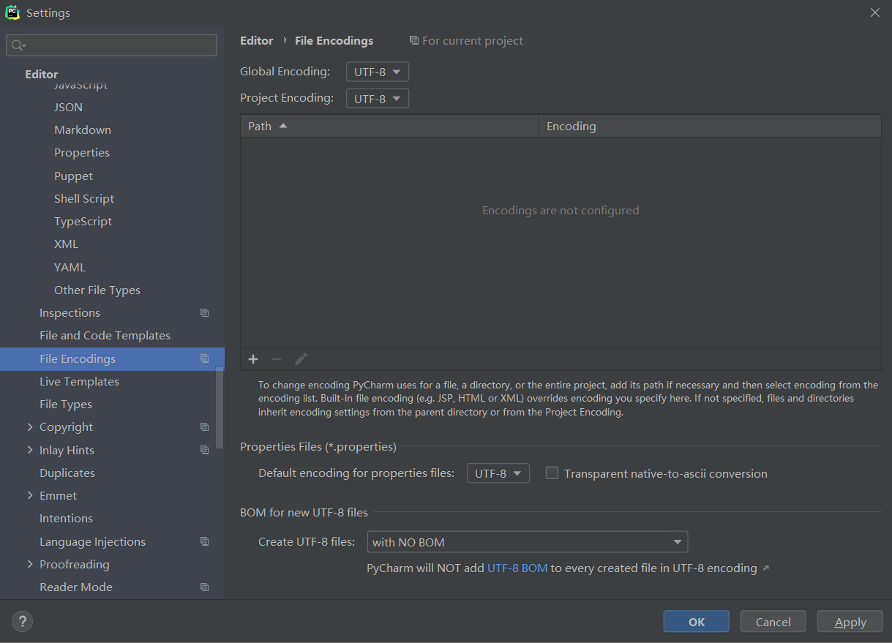
2. 设置新建文件的默认代码和内容：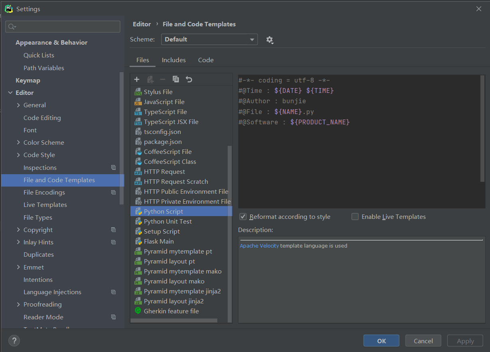

你可以在 PyCharm 的官网上找到所有的 File template variables：[File template variables | PyCharm (jetbrains.com)](https://www.jetbrains.com/help/pycharm/file-template-variables.html)

#### 在 console 里执行命令：

前面已经提到过在命令行中执行 Python 代码，这当然是运行已经编写好的 Python 程序或脚本的好办法。但是命令行中执行程序后就立刻输出结果并结束程序，那要是程序结束后我还想继续执行更多操作怎么办？

这时候你可能需要用到 Python Console 功能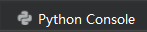

pycharm 中的 console 就是一个 pychon 的直接运行环境，这里允许你以解释性的形式逐句输入并运行 python 代码。值得一提的是，在 PyCharm 中运行你的 Python 文件时，默认输出到 Python Console 中，这意味着你可以在程序结束完成之后接着输入更多内容

:::tip

当你有不确定的代码需要验证的时候，不妨先复制到 console 里试一试！

:::

### 数据类型：

在学习语法之前，你需要了解构成程序的要素是什么

如果你有过其它语言的编程经验的话，你可能会说“数据结构+算法”

但是如果你纯新手的话，那这可能难以理解。那么我会说，程序是由符合当前编程语言语法的语句依次执行生成的，构建程序的基本内容是数据的运算与处理

很显然，就数据的处理而言，直接使用 1 + 2 等既定的数据常量是远远不够的——我们需要应付更多变的情况——这就要用到**变量**

#### Python 变量命名规则

和其它语言一样，Python 也有自己的变量命名规则

- 第一个字符必须是字母表中字母或下划线 **\_**

- 标识符的其他的部分由字母、数字和下划线组成

- 标识符对大小写敏感

- 注意避开 python 自己的保留字符

  你可以通过以下语句来查询 Python 保留的关键字符

  ```python
  import keyword
  keyword.kwlist
  ```

示例：
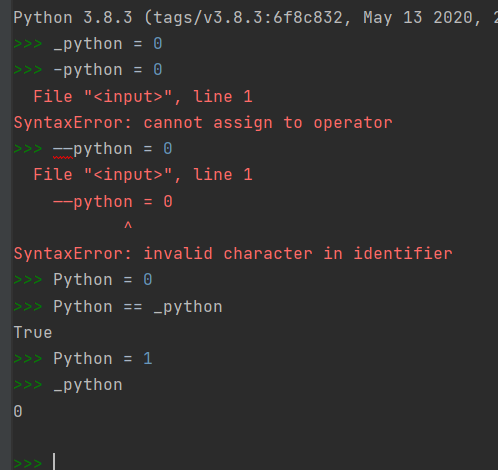

#### 关于变量的基本数据类型：

在 Python 中，变量就是变量，它没有类型，我们所说的"类型"是变量所指的内存中对象的类型。

Python 中的变量不需要声明。每个变量在使用前都必须赋值，变量赋值以后该变量才会被创建。

> 不过 Python 中的确存在这些“基本数据类型”如：int，float 之类的，并且它们之间都存在着严格的限制
>
> 你可以使用 type() 函数来检查当前变量的数据类型：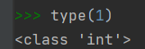

#### 标准数据类型：

- **不可变数据（3 个）：**Number（数字）、String（字符串）、Tuple（元组）；
- **可变数据（3 个）：**List（列表）、Dictionary（字典）、Set（集合）。

共六种

##### 关于可变与不可变数据：

什么是不可变数据？

在 Python 中，我们可以设立变量 a = 1，之后我们可以对 a 的值做出改变，比如又执行语句 a = 2，这时 a 当然就不再指向 1，但是 1 这个“内容”本身并没有改变。

而可变数据则是可以改变数据的具体内容：如语句 a = [1, 2]，我们可以将 a 中的[0], [1]等数据单独拎出来并做出改变而并不改变 a 本身的指向

这些“指向”，“内容”都是基于内存地址来说的。

不可变数据类型： 当该数据类型的对应变量的值发生了改变，那么它对应的内存地址也会发生改变，对于这种数据类型，就称不可变数据类型。

可变数据类型 ：当该数据类型的对应变量的值发生了改变，那么它对应的内存地址不发生改变，对于这种数据类型，就称可变数据类型。

你可以用 `id(变量名)`来查验对应变量的内存地址是否发生变化

##### 数字：

int float...

##### 列表：Python 中功能最强大的数据类型

用“[ ]”来定义列表！

列表支持：

1. 列表间的拼接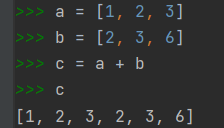
2. 定义以列表为元素的列表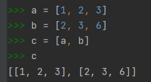
3. 将整个列表赋给新列表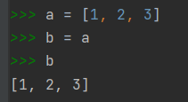（也可以使用 copy()函数：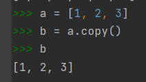)
4. 通过 append()，entend()，insert()，实现增
5. 通过 pop()，remove()，实现删
6. 支持通过截取来获取列表内容（截取参看字符串

##### 元组：”常量列表“

不能改变元素个数的列表，列表中一切涉及改变元素个数改变的功能全部 NG

用 “( )" 来定义一个元组

:::warning

元组中只包含一个元素时，需要在元素后面添加逗号，否则括号会被当作运算符使用：

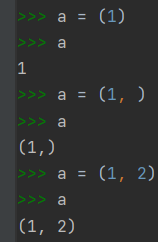

:::

##### 字符串：特化列表

1. python 允许直接把字符/字符串存储到一个变量中

```python
>>> a = "bunjie"
>>> a[-1]
'e'
>>> a[0]
'b'
>>> a[1]
'u'
>>> a[:]
'bunjie'
>>> a[0:1]
'b'
>>> a[0:5]
'bunji'
>>> a[0:6]
'bunjie'
>>> a[0:7]
'bunjie' #没有报错
>>> a[-1:-2]
''
>>> a[:-1]
'bunji'
>>> a[:-6]
''
>>> a[:-5]
'b'
```

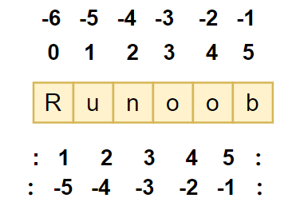

##### 字典：

使用键值对进行匹配，类似 c 语言中的“枚举类型”，以键值对构建数据内容 `{key: value, ...}`

```python
d = {key1 : value1, key2 : value2, key3 : value3 }
print(d[key1])
# 输出：value1

D = {} # 我们可以使用大括号来创建空字典
```

字典可能是所有数据类型中最高效的，因为取元素时直接采用 key 来定点查找而不是像是 list 等数据类型依次迭代查找

##### 集合：

是的，就是集合论中的集合

总体来说，集合这种数据类型我们使用得较少，做可以使用大括号 **{ }** 或者 **set()** 函数创建集合，注意：创建一个空集合必须用 **set()** 而不是 **{ }**，因为 **{ }** 是用来创建一个空字典。

创建格式：

```python
parame1 = {value01, value02, ...} # 注意格式
parame2 = set() # set只允许单个参数，我们一般使用set来创建空集合
```

> 根据我们中学时所学到的知识，我们知道：集合具有确定性、互异性、无序性
>
> 根据这些性质，我们获知：单个确定数据只会出现一次。所以如果出现重复的值，集合会把相同的合并。

### 语法：

#### 关于注释：

##### 什么是注释？

注释是你在程序中插入的解释性的文字，单纯的只是为了方便别人和自己理解当前程序。程序在运行时会忽略所有被注释的部分，所以你留下的注释并不会对程序功能造成任何实际上的影响

##### python 中的注释方式：

1. 以 **`#`** 作为单行注释，在 pycharm 中，你可以使用 `ctrl + /` 来快速注释一整行:

   ```python
   # 这是一个单行注释
   ```

2. 以一对三个连续的单引号**`''' '''`**，或一对三个连续的双引号**`""" """`**来作为多行注释

   ```python
   """
   这是一个多行注释
   """
   
   '''
   这也是一个多行注释
   '''
   ```

#### 关于缩进：

Python 没有 `{ }`，它采用精确的缩进来确定控制语句的执行范围！

一个项目里最好只采用 _tab_ 和 _space_ 两种中的一种缩进，如果在一个控制体里使用了两种缩进格式是会报错的

个人建议使用 _tab_ 作为缩进

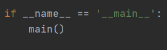

python 没有分号：“ ; ”， 语句间几乎没有大括号，代价是精确的缩进！

#### 条件控制语句

##### 为什么使用条件控制？

当然是为了以一个程序去应对多种可能性

例如：我们解决除法运算时，我们当然需要以除数不为零来分类，但是我们不可能因为这一点就开发两个程序，并且要求用户根据除数是什么来选择运行那个程序——这就要求我们在设计程序的时候为某些特定情况运行特定代码

##### Python 中的条件控制语句长什么样？

Python 中 if 语句的一般形式如下所示：

```python
if condition_1:
    statement_block_1
elif condition_2:
    statement_block_2
# 更多情况使用elif condiition_3: ... 并以此类推
else:
    statement_block_3
```

- 如果 "condition_1" 为 True 将执行 "statement_block_1" 块语句
- 如果 "condition_1" 为 False，将**判断** "condition_2"
- 如果"condition_2" 为 True 将执行 "statement_block_2" 块语句
- 如果 "condition_1"与"condition_2"均为 False，那么将执行"statement_block_3"块语句

:::warning

1、每个条件后面要使用冒号 **:**，表示接下来是满足条件后要执行的语句块。

2、使用缩进来划分语句块，相同缩进数的语句在一起组成一个语句块。

3、在 Python 中没有 switch – case 语句。

:::

#### 循环语句：

循环的意义有点类似于乘法之于加法，它提供了一种解出某一个条件下的最终结果的方式。借助循环，计算机能够非常高效的完成人很难或无法完成的事情，比如说，在大量文件中查找包含某个搜索词的文档，对几十万条销售数据进行统计汇总等。

##### while 循环：

```python
while 判断条件(condition)：
	执行语句(statements)……
# 每次循环之前都会进行一次condition是否为真的判断，如果结果为false，则立即停止循环
```

##### for 循环：

```python
for <variable> in <sequence>:
    <statements>
else:
    <statements>
```

例一：

例二：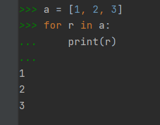

## 基础语法到此结束！

## 附录 1：python 包的获取和管理

类似于 Node 的 npm，Linux 中的 yum，apt 等，python 有自己的包管理工具——pip，这也是 Python 安装时自带的

但是直接从 pypi 上获取包的速度太慢~~长城防火墙~~，所以我们要借用一些国内的镜像网站，比如[清华大学的清华源镜像网站](https://pypi.tuna.tsinghua.edu.cn/simple/)

你可以从 console(非 python 的编辑模式)里用 python 的 pip 语句指定国内的镜像源来直接安装包，如：

```powershell
pip install numpy -i https://pypi.tuna.tsinghua.edu.cn/simple/
# -i代表当前安装操作使用后面的临时源
```

不过我们也可以通过 ctrl + shift + s 打开 pycharm 的 settings 进入 Project: (你当前的项目名) >> Python InterPreter 来直接安装包。记得在 manage repository 中添加国内的 python 源的地址

> 国内 Python 源建议使用清华源：https://pypi.tuna.tsinghua.edu.cn/simple/

## 附录 2：Python 运算符

运算符：（python 的语法糖很大一部分集中在多种多样的运算符，这也是让书写 python 代码速度起飞的重要原因！）

~~（虽然刚接触的时候会因为大量的运算符而痛苦 😀）~~

### 运算符手册：

#### 算数运算符：（相比 c 语言多了幂运算于取整运算）

| 运算符 | 描述                                            | 实例                                    |
| :----- | :---------------------------------------------- | :-------------------------------------- |
| +      | 加 - 两个对象相加                               | a + b 输出结果 31                       |
| -      | 减 - 得到负数或是一个数减去另一个数             | a - b 输出结果 -11                      |
| \*     | 乘 - 两个数相乘或是返回一个被重复若干次的字符串 | a \* b 输出结果 210                     |
| /      | 除 - x 除以 y                                   | b / a 输出结果 2.1                      |
| %      | 取模 - 返回除法的余数                           | b % a 输出结果 1                        |
| \*\*   | 幂 - 返回 x 的 y 次幂                           | a\*\*b 为 10 的 21 次方                 |
| //     | 取整除 - 向下取接近商的整数                     | >>> 9//2 <br />4 <br/>>>> -9//2<br/> -5 |

#### 比较运算符：（和 c 语言相同）

| 运算符 | 描述                                                                                                                                  | 实例                  |
| :----- | :------------------------------------------------------------------------------------------------------------------------------------ | :-------------------- |
| ==     | 等于 - 比较对象是否相等                                                                                                               | (a == b) 返回 False。 |
| !=     | 不等于 - 比较两个对象是否不相等                                                                                                       | (a != b) 返回 True。  |
| >      | 大于 - 返回 x 是否大于 y                                                                                                              | (a > b) 返回 False。  |
| <      | 小于 - 返回 x 是否小于 y。所有比较运算符返回 1 表示真，返回 0 表示假。这分别与特殊的变量 True 和 False 等价。注意，这些变量名的大写。 | (a < b) 返回 True。   |
| >=     | 大于等于 - 返回 x 是否大于等于 y。                                                                                                    | (a >= b) 返回 False。 |
| <=     | 小于等于 - 返回 x 是否小于等于 y。                                                                                                    | (a <= b) 返回 True。  |

#### 赋值运算：

| 运算符 | 描述             | 实例                                  |
| :----- | :--------------- | :------------------------------------ |
| =      | 简单的赋值运算符 | c = a + b 将 a + b 的运算结果赋值为 c |
| +=     | 加法赋值运算符   | c += a 等效于 c = c + a               |
| -=     | 减法赋值运算符   | c -= a 等效于 c = c - a               |
| \*=    | 乘法赋值运算符   | c _= a 等效于 c = c _ a               |
| /=     | 除法赋值运算符   | c /= a 等效于 c = c / a               |
| %=     | 取模赋值运算符   | c %= a 等效于 c = c % a               |
| \*\*=  | 幂赋值运算符     | c **= a 等效于 c = c ** a             |
| //=    | 取整除赋值运算符 | c //= a 等效于 c = c // a             |

:::warning

特别提醒！
python 中没有像 c 语言一样的自加运算！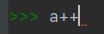

:::

#### 位运算符：（和 c 语言相同）

| 运算符 | 描述:(下表中变量 a 为 60，b 为 13 二进制格式如下：)                                              | 实例                                                                           |
| :----- | :----------------------------------------------------------------------------------------------- | :----------------------------------------------------------------------------- |
| &      | 按位与运算符：参与运算的两个值,如果两个相应位都为 1,则该位的结果为 1,否则为 0                    | (a & b) 输出结果 12 ，二进制解释： 0000 1100                                   |
| \|     | 按位或运算符：只要对应的二个二进位有一个为 1 时，结果位就为 1。                                  | (a \| b) 输出结果 61 ，二进制解释： 0011 1101                                  |
| ^      | 按位异或运算符：当两对应的二进位相异时，结果为 1                                                 | (a ^ b) 输出结果 49 ，二进制解释： 0011 0001                                   |
| ~      | 按位取反运算符：对数据的每个二进制位取反,即把 1 变为 0,把 0 变为 1。**~x** 类似于 **-x-1**       | (~a ) 输出结果 -61 ，二进制解释： 1100 0011， 在一个有符号二进制数的补码形式。 |
| <<     | 左移动运算符：运算数的各二进位全部左移若干位，由"<<"右边的数指定移动的位数，高位丢弃，低位补 0。 | a << 2 输出结果 240 ，二进制解释： 1111 0000                                   |
| >>     | 右移动运算符：把">>"左边的运算数的各二进位全部右移若干位，">>"右边的数指定移动的位数             | a >> 2 输出结果 15 ，二进制解释： 0000 1111                                    |

#### 逻辑运算符：

| 运算符 | 逻辑表达式 | 描述（令 a=10， b=20）                                                                | 实例                                                                       |
| :----- | :--------- | :------------------------------------------------------------------------------------ | :------------------------------------------------------------------------- |
| and    | x and y    | 布尔"与" - 如果 x 为 False，x and y 返回 x 的值，否则返回 y 的计算值。                | (a and b) 返回 20。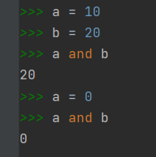 |
| or     | x or y     | 布尔"或" - 如果 x 是 True，它返回 x 的值，否则它返回 y 的计算值。(与“与运算恰好相反”) | (a or b) 返回 10。                                                         |
| not    | not x      | 布尔"非" - 如果 x 为 True，返回 False 。如果 x 为 False，它返回 True。                | not(a and b) 返回 False                                                    |

> 补充说明：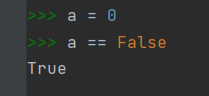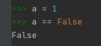

#### 成员运算符：

| 运算符 | 描述                                                    | 实例                                              |
| :----- | :------------------------------------------------------ | :------------------------------------------------ |
| in     | 如果在指定的序列中找到值返回 True，否则返回 False。     | x 在 y 序列中 , 如果 x 在 y 序列中返回 True。     |
| not in | 如果在指定的序列中没有找到值返回 True，否则返回 False。 | x 不在 y 序列中 , 如果 x 不在 y 序列中返回 True。 |

#### 身份运算符：

（有种 == 和 != 的感觉，但是确实不一样！）

_is 用于判断两个变量引用对象是否为同一个， == 用于判断引用变量的值是否相等。_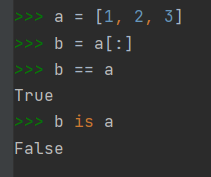

| 运算符 | 描述（注：id () 函数用于获取对象内存地址。） | 实例                                                                                                 |
| :----- | :------------------------------------------- | :--------------------------------------------------------------------------------------------------- |
| is     | is 是判断两个标识符是不是引用自一个对象      | **x is y**, 类似 **id(x) == id(y)** , 如果引用的是同一个对象则返回 True，否则返回 False              |
| is not | is not 是判断两个标识符是不是引用自不同对象  | **x is not y** ， 类似 **id(a) != id(b)**。如果引用的不是同一个对象则返回结果 True，否则返回 False。 |

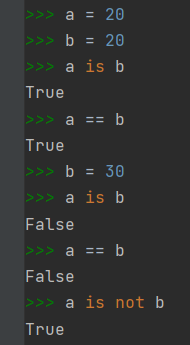

### Python 运算符优先级

以下表格列出了从最高到最低优先级的所有运算符：

| 运算符                      | 描述                                                   |
| :-------------------------- | :----------------------------------------------------- |
| \*\*                        | 指数 (最高优先级)                                      |
| ~ + -                       | 按位翻转, 一元加号和减号 (最后两个的方法名为 +@ 和 -@) |
| \* / % //                   | 乘，除，求余数和取整除                                 |
| + -                         | 加法减法                                               |
| >> <<                       | 右移，左移运算符                                       |
| &                           | 位 'AND'                                               |
| ^ \|                        | 位运算符                                               |
| <= < > >=                   | 比较运算符                                             |
| == !=                       | 等于运算符                                             |
| = %= /= //= -= += \*= \*\*= | 赋值运算符                                             |
| is is not                   | 身份运算符                                             |
| in not in                   | 成员运算符                                             |
| not and or                  | 逻辑运算符                                             |

最后~~（传教）~~:我即使是死了，钉在棺材里了，也要在墓里，用这腐朽的声带喊出：“**vocaloid forever！！！**"

最后的最后：都看到这里了，不听支歌吗?(❁'◡'❁)

<iframe src="//player.bilibili.com/player.html?aid=245852635&bvid=BV1Vv411t7Gb&cid=273023330&page=1" scrolling="no" border="0" frameborder="no" framespacing="0" allowfullscreen="true" width="100%" height="500" scrolling="no" frameborder="0" sandbox="allow-top-navigation allow-same-origin allow-forms allow-scripts"> </iframe>

## 参考资料：

1. [Python3 教程 | 菜鸟教程 (runoob.com)](https://www.runoob.com/python3/python3-tutorial.html)
