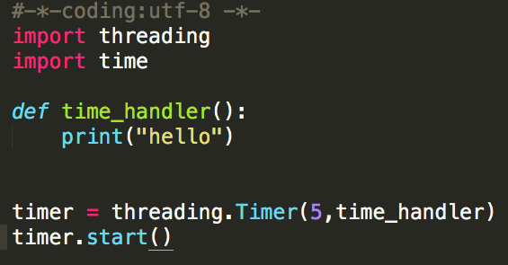
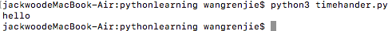
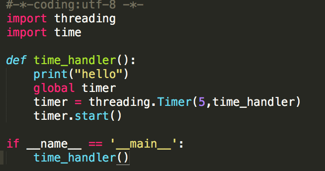
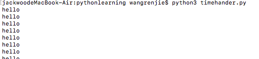
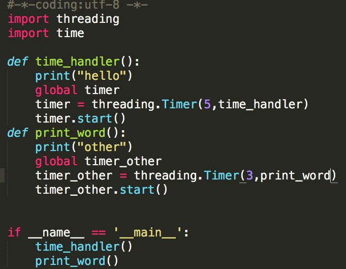
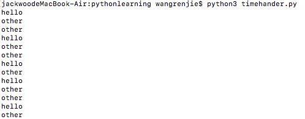

# python 定时器

在工作中，我们有时候会需要定时去做一些操作，比如凌晨更新远程代码，仓库每小时更新一次远程分支。这些操作，我们如果要人工进行，不仅要耗费精力，也更容易出错。

如果一件事情，具有周期操作的特点，那么把这件事情设置为定时器操作，最合适不过。

## 不借助第三方插件

在不借助第三方插件的情况下，python内部可以有多种方式完成定时器操作，这里介绍一种简单易行的方法：

利用threading.Timer方法创建一个定时器。

一个简单的需求，程序启动5s后在屏幕上打印一个hello
首先介绍一下threading.Timer的使用方法：

class threading.Timer(interval, function, args=[], kwargs={})

创建一个timer，在interval秒过去之后，它将以参数args和关键字参数kwargs运行function 。

调用该函数回返回一个定时器的句柄，同时也获得了一个定时器实例。

但是这时，定时器只是被创建，被没有启动，需要调用实例里面的

start（）方法启动定时器。如果在定时过程中想要取消该定时器，需要使用cancel()函数。

那么这个小需求，就很简单了，代码可以这么写：

定义一个定时时间到了，需要调用的函数，方便Timer函数回调，创建定时器实例，并设置定时时间，或得实例后，启动定时器。

但是我们发现，定时器只执行了一次，如何要定时器，能够不停的执行下去呢？

一种方法是利用while（True），不停的创建定时器并启动，显然这种方法显得笨拙，而且会一直占用线程。

另外一种方法，就是在回调函数中，创建定时器并启动，形成递归调用。这里着重说下这种方法。

运行效果如下：

程序看起来很简单，通过在回调函数里面，重新创建定时器，来使得定时器能够一直工作。

但是值得注意的是，定时器的句柄需要定义成为一个全局变量，这样做的好处是，创建的定时器进程和实例不会堆积，而是覆盖，避免不必要的内存占用。

另外利用threading创建的定时器还有一个好处是，每一个定时器的创建都是在一个新的进程里面，所以定时器是不阻塞式的，比如，我们创建两个定时器，让它们分别打印不同的字符串：

我们运行程序可以看到：

这样一个简单的定时器就完成了！

但是这并不是一个十分健壮的定时器，还有很多问题需要考虑，比如，如何终止定时器？在何时使用cancel（）？如果创建定时器实例失败，应该如何处理？等等。

不过一个定时器的基本雏形已经完成了，剩下的就是根据需要添加不同的功能。

## Schedule插件

[schedule · PyPI](https://pypi.org/project/schedule/)
