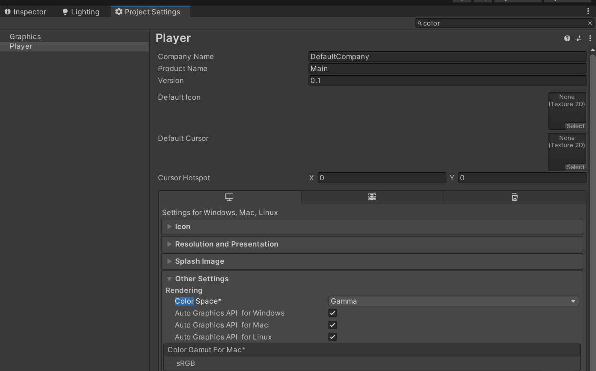

# Chapter 0: 开始 - 准备工作

## 在开始阅读本书之前可以提前准备的资料：

- 彩图：[《Unity Shader入门精要》随书彩色插图 (candycat1992.github.io)](http://candycat1992.github.io/unity_shaders_book/unity_shaders_book_images.html)
- 实例工程仓库：[candycat1992/Unity_Shaders_Book: 书籍《Unity Shader入门精要》源代码 (github.com)](https://github.com/candycat1992/Unity_Shaders_Book)
- 勘误列表：[《Unity Shader入门精要》勘误 (candycat1992.github.io)](http://candycat1992.github.io/unity_shaders_book/unity_shaders_book_corrigenda.html)

## 需要的项目设置：

### 项目色彩空间设置：

> 书中的实例都是处于色彩空间为Gamma下的，而在Unity2021.3LTS下默认是Linear空间下的

