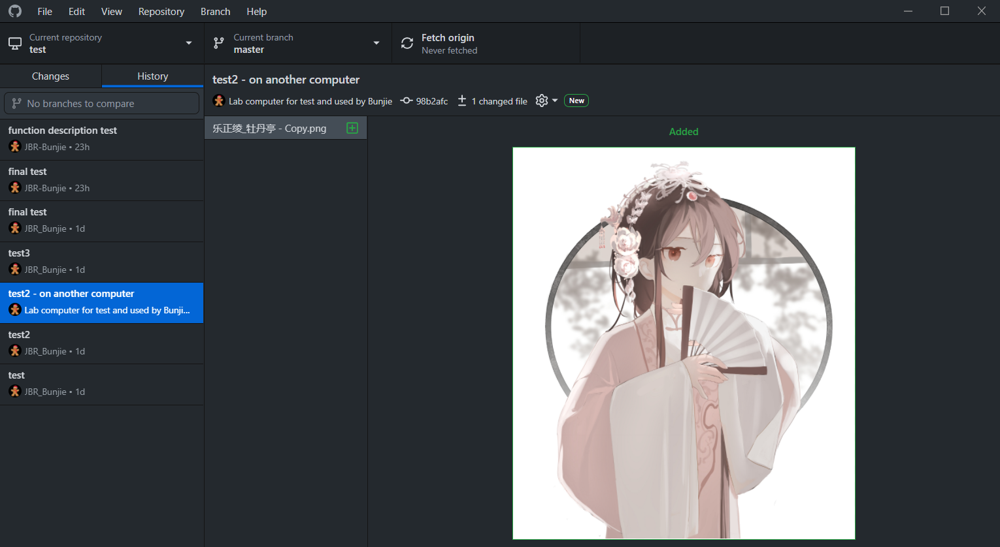
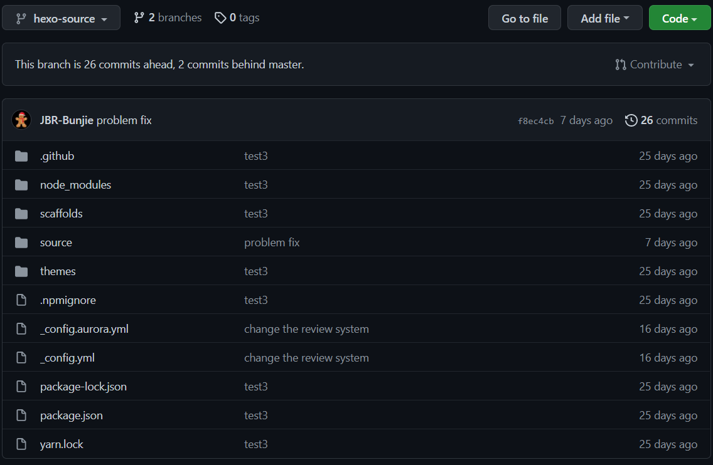
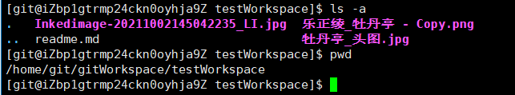

# 云服务器上的私有Git仓库搭建

---

## 环境：

阿里云服务器CentOS7.6

## 部署Git

### 安装Git：

#### 非CentOS安装Git：

绝大多数Linux发行版安装Git只需要一条命令——参看：<a href="#gitLinux">Git官方指南</a>

#### 关于CentOS安装：

与绝大部分Linux系统不同，redhat发行的系统通过包管理工具yum最高只能安装到1.8.3版本，需要使用更高版本的话都只能通过源码编译安装

>Red Hat Enterprise Linux, Oracle Linux, CentOS, Scientific Linux, et al.
>
>RHEL and derivatives typically ship older versions of git. You can [download a tarball](#gitDownloadPage) and build from source, or use a 3rd-party repository such as [the IUS Community Project](#gitDownloadPage) to obtain a more recent version of git.

##### 下载源码

首先我们先选择要安装的Git版本，我选择了2.33.0，下载并传到服务器上


##### 解压，编译，安装

```bash
# 查看git版本
git --version
 
# 卸载
# yum remove git
yum eras

# 进入源码目录
$ cd git-2.33.0

# 安装工具和依赖
$ yum install libcurl-devel
$ yum install expat-devel
$ yum install openssl-devel
 
# 编译
$ make prefix=/usr/local/git all
# 编译内容带/usr/locak/git目录
$ make prefix=/usr/local/git install
# 在/usr/local/git目录完成安装，请注意，这个不是git的默认路径，所以我们还需要为git的bin中文件建立软连接到/usr/bin中
```

:::tip

关于编译命令：make

make all：编译所有的目标

make install：安装已编译好的程序

:::warning

By default, `make install` will install all the files in `/usr/local/bin`, `/usr/local/lib` etc.  You can specify an installation prefix other than `/usr/local' using `--prefix', for instance `--prefix=$HOME`

:::

:::

##### 添加到环境变量

```bash
# 将git路径加入bashrc配置
$ echo "export PATH=$PATH:/usr/local/git/bin" >>/etc/bashrc
 
# 应用bashrc
$ source /etc/bashrc

# 验证结果
$ git --version
# git version 2.33.0
```

##### 建立软连接

```bash
ln -s /usr/local/git/bin/git-upload-pack /usr/bin/git-upload-pack
ln -s /usr/local/git/bin/git-r-pack /usr/bin/git-receive-pack
# 一定要注意抓取地址和目标地址都要调换！
# 如果没有在/usr/bin目录添加这两个文件的话，会因为没有处理请求的命令，报出没有权限的错
```

### 创建仓库：

```bash
cd /home/git # 进入git用户目录
# 这个目录下会有三个以.记来隐藏的文件，请不要删除

# 请以git用户的身份执行以下命令，否则还要执行修改用户目录权限的命令
# 否则当客户端在以git身份执行clone等操作时会因为没有权限而失败
git init --bare yourRepositoryName.git # 这个命令有多个版本，如：git init yourRepositoryName.git, git init -bare youreRepositoryName.git 请注意区分
```

### 在客户端克隆仓库：

```powershell
git clone git@server-IP:/home/git/test.git
```

完成！




### 添加工作空间：

一般来讲，bare仓库不像是普通的仓库那样会在根目录中保存文件，bare仓库不保存文件并将.git文件夹下的全部内容直接暴露在当前仓库根目录中，且不包含工作区

工作空间示例：



要查看工作空间，我们需要使用一个<a href="#hook">钩子</a>：post-receive钩子

有了这个钩子，我们要在裸仓库内看到用户提交的工作空间很简单了。只需要创建/编写post-receivek即可：

在服务器裸仓库内

```bash
cd hooks
```

创建并编辑post-receive

```bash
vim post-receive
```

输入内容：

```bash
#!/bin/sh
git --work-tree=#工作空间# --git-dir=#Git仓库地址# checkout -f
```
例如，我此处的配置是：

```bash
#!/bin/sh
git --work-tree=/home/git/gitWorkspace/testWorkspace --git-dir=/home/git/test.git checkout -f
```

+ 工作空间：服务器上空目录地址，git用户需要有读写权限。
+ Git仓库地址：服务器上本仓库地址。

赋予执行权限：

```bash
chmod +x post-receive
# 用ls -alc
```


之后，用户push提交后，–work-tree参数定义的工作空间就可以看到用户提交的具体内容：



---

## 参考内容：

### 教程中提到的webstie

[Git Website (git-scm.com)](https://git-scm.com/)

<span id="gitLinux">[Git Download Page(git-scm.com)](https://git-scm.com/download/linux)</span>

<span id="gitDownloadPage">[Index of /pub/software/scm/git/ (kernel.org)](https://mirrors.edge.kernel.org/pub/software/scm/git/)</span>

<span id="IUS">[IUS](https://ius.io/)</span>

<span id="hook">[Git - Git 钩子 (git-scm.com)](https://git-scm.com/book/zh/v2/自定义-Git-Git-钩子)</span>

### 拓展资料

[all about "bare" repos -- what, why, and how to fix a non-bare push (htmlpreview.github.io)](http://htmlpreview.github.io/?https://github.com/sitaramc/sitaramc.github.com/blob/dce410b2a2804723676db9cabd7bb506b6d9ba05/concepts/bare.html)

[git - Where are the files in a bare repository? - Stack Overflow](https://stackoverflow.com/questions/37033032/where-are-the-files-in-a-bare-repository)

[Git - Getting Git on a Server (git-scm.com)](https://git-scm.com/book/en/v2/Git-on-the-Server-Getting-Git-on-a-Server)

[Accessing files of a repository from the Git server - Stack Overflow

<iframe src="//player.bilibili.com/player.html?aid=932066812&bvid=BV11M4y1N7q6&cid=383208463&page=1" scrolling="no" border="0" frameborder="no" framespacing="0" allowfullscreen="true" width="100%" height="500" scrolling="no" frameborder="0" sandbox="allow-top-navigation allow-same-origin allow-forms allow-scripts"> </iframe>

