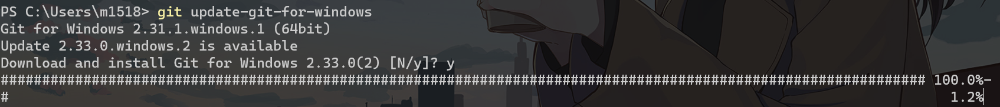
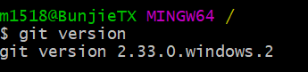

那么现在，如果我的就电脑上已经安装了一个version为2.31.1的git

问题来了，如何将它更新至最新版本呢，

[How to upgrade Git on Windows to the latest version - Stack Overflow](https://stackoverflow.com/questions/13790592/how-to-upgrade-git-on-windows-to-the-latest-version)

如果你迫切想要知道解决方法的话，那么，你可以直接运行这个命令

> C:\\> git update-git-for-windows

这个命令对于当前版本>2.16.1的Git有效

对于Git版本在2.14到2.16.1之间的，请使用如下命令：

> C;\\> git update

至于更低的，就只能先卸载旧版本再重装了，它太古董了

等待你的进程完成即可

